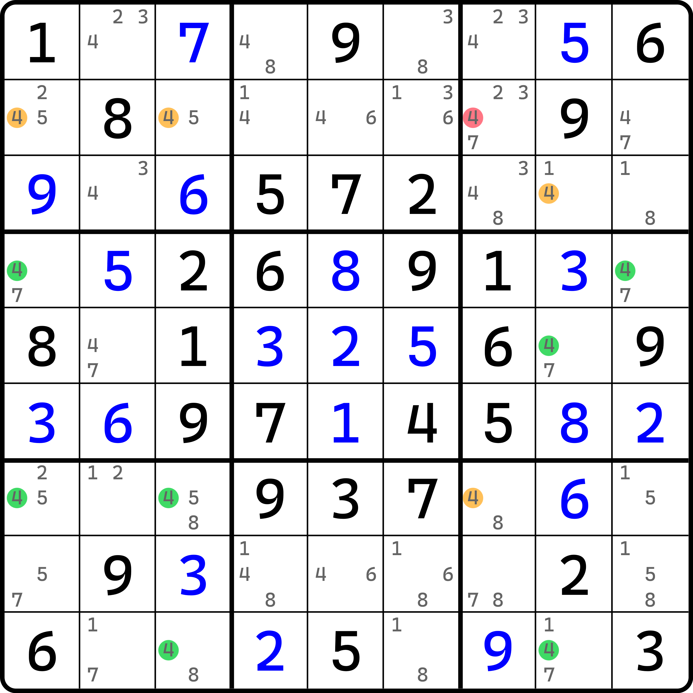
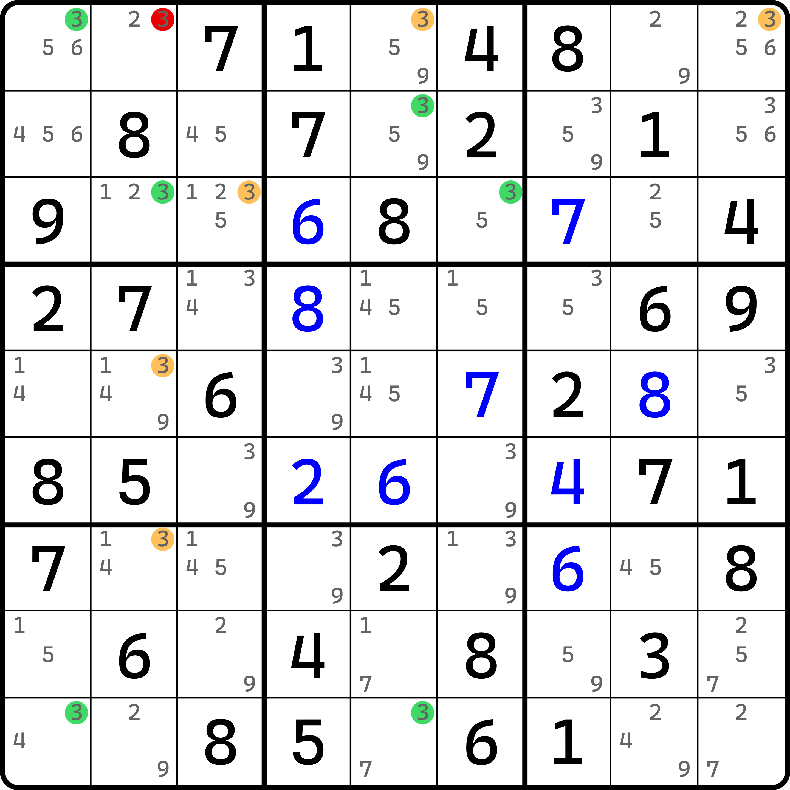
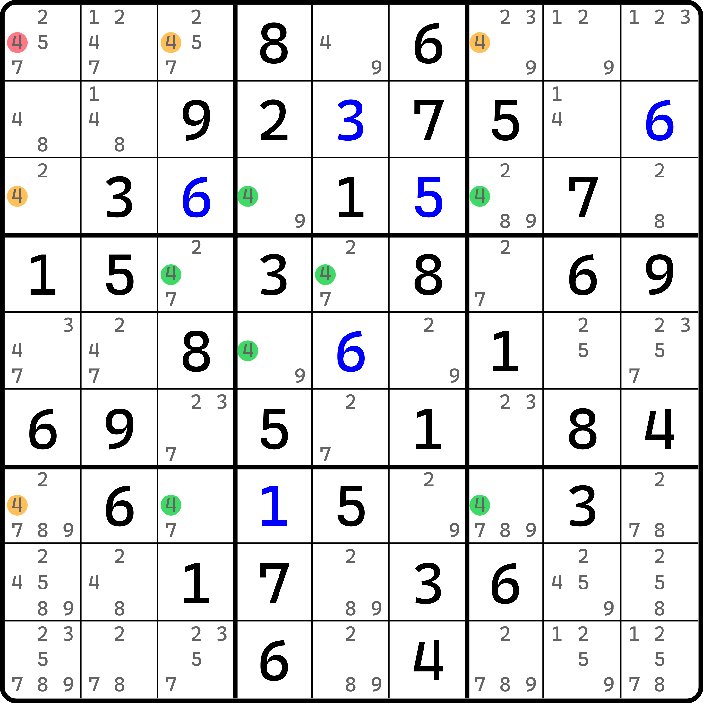
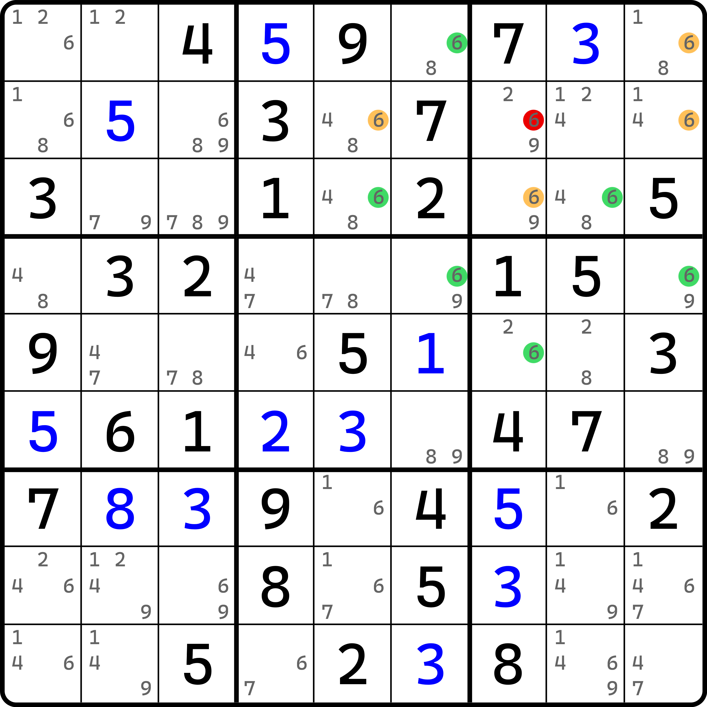
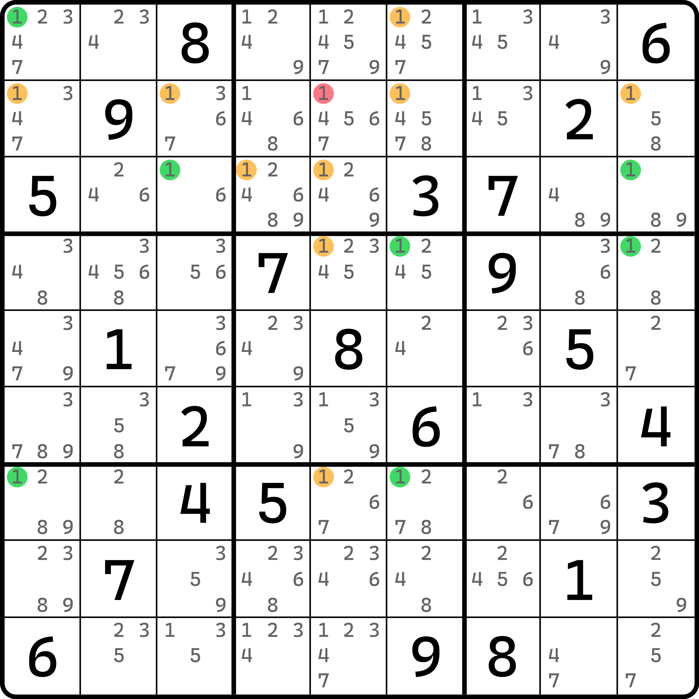
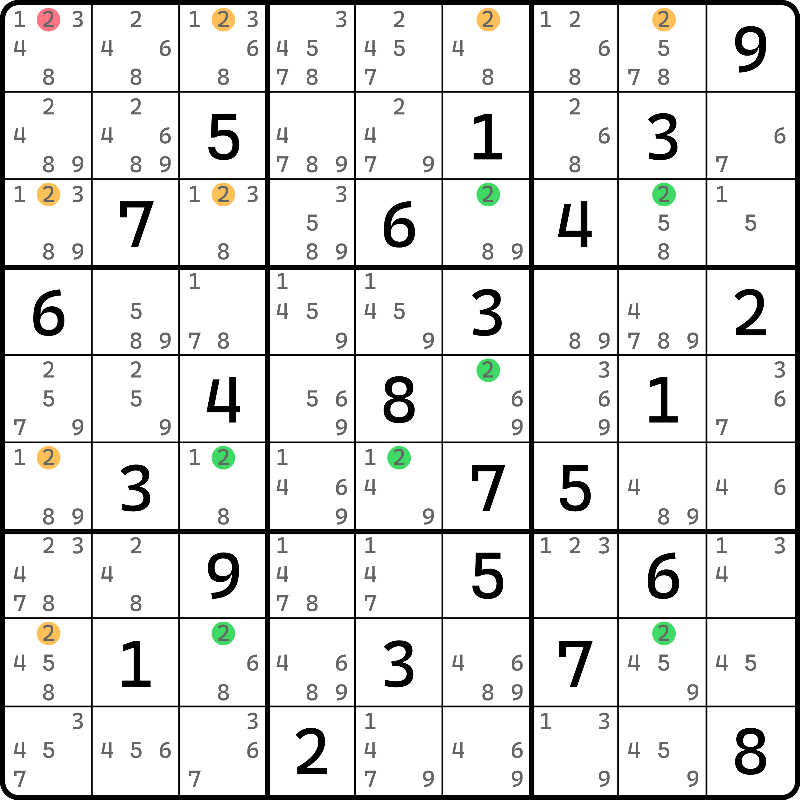
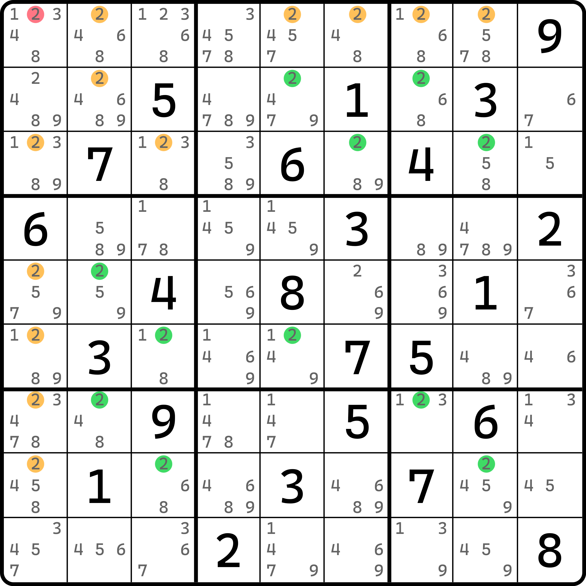

# 守护者的基本推理

## 基础推理 <a href="#reasoning" id="reasoning"></a>

<figure><figcaption><p>守护者 基础逻辑</p></figcaption></figure>

如图所示。我们把绿色的所有候选数 4 全部按线条串起来，我们可以得到如下的一些区域（比如从 `r4c1` 起步）：

```
r4 -> b6 -> c8 -> r9 -> c3 -> r7 -> c1
```

我们可以有这样 7 个区域可以使得结构形成环路。仔细观察 7 个区域，如果所有橘色的候选数 4 在盘面里不存在的话，那么对于 7 个区域的每一个区域，数字 4 都只能填写在绿色的两处位置的其中一个。比如说 `r4` 里只有 `r4c19` 可以填入 4，再比如 `c1` 里只有 `r247c1` 可以填 4。如果 4 橘色位置不存在，则 4 只能落在 `r47c1` 之中。

按照规则，显然 7 个区域里两两同区域就只能容得下一处位置填入，所以只能保证整个环路里任意连续三个位置都只能交替出现填和不填的状态，即 $$A - B - C$$ 串联的链路里，要么只能是 $$A$$ 和 $$C$$ 填，要么只能是 $$B$$ 填。

但是，这么做显然只能在长度为偶数的环里才能正常填写 4 的状态。如果是奇数长度的话，填写 4 的位置不论如何交替，最终都会出现两处同一区域下的两个单元格同时出现 4 填入的情况，这必然是矛盾的。

所以，橘色的四处填 4 的位置就不能从盘面里消失；换言之，这 4 个候选数 4 的位置就必须有至少一处为真。按照基础的影响范围取交集的逻辑，显然可以得到 `r2c7(4)` 是四个候选数 4 都可以删掉的位置，所以 `r2c7 <> 4` 是这个题目的结论。

我们把这个推理过程称为守护者逻辑。其中，我们把 `{r2c13, r3c8, r7c7}(4)` 称为结构的守护者。这四个候选数守护了结构不会出现死亡的局面。这一点在之前负秩结构里有简要提过。

> 另外，这个技巧还有一个名字，叫 Broken Wing。不过鉴于它容易和 Wing 类的技巧从名称上搞混淆，所以就不多提及了。

## 造成自噬的守护者 <a href="#guardians-make-cannibalism" id="guardians-make-cannibalism"></a>

<figure><figcaption><p>守护者 自噬逻辑</p></figcaption></figure>

如图所示。本题的环比较难发现。它借用的是 `{r1c12, r2c5, r3c26, r9c15}(3)` 这 7 个候选数。要注意的是，`r1c2(3)` 作为删数，本题也会用于构成环路。

我们仍然按照前文的方式将其环路用到的区域列出：

```
r1 -> c2 -> r3 -> b2 -> c5 -> r9 -> c1
```

这样 7 个区域。显然，橘色数字在本题用到的是 `r1c59(3)`、`r3c3(3)` 和 `r57c2(3)` 这五个位置。如果它们全部消失的话，这个长度为 7 的环路必然会出现同一个区域下两处位置都填 3 的情况，显然这是矛盾的。所以，橘色的 5 个候选数 3 至少有一个是为真的。

显然，`r1c2(3)` 是这 5 个候选数 3 都可以删除的位置，所以 `r1c2 <> 3` 是这个题的结论。因为结论是后出现的，而 `r1c2(3)` 被我们用作结构，它在没有删除之前是存在于盘面之中的，所以该候选数可以被用于删数。所以这是一个自噬的逻辑。

## 其他例子

我们来看一些其他的例子。下面的例子希望各位自己理解。

<figure><figcaption><p>例子 1</p></figcaption></figure>

这是一个比较基础的守护者。

<figure><figcaption><p>例子 2</p></figcaption></figure>

如图所示。这个环的结构长得比较优秀。

<figure><figcaption><p>例子 3</p></figcaption></figure>

如图所示。这个例子用到的守护者比较多。

<figure><figcaption><p>例子 4</p></figcaption></figure>

如图所示，这也是一个比较优美的图。

<figure><figcaption><p>例子 5</p></figcaption></figure>

如图所示。
