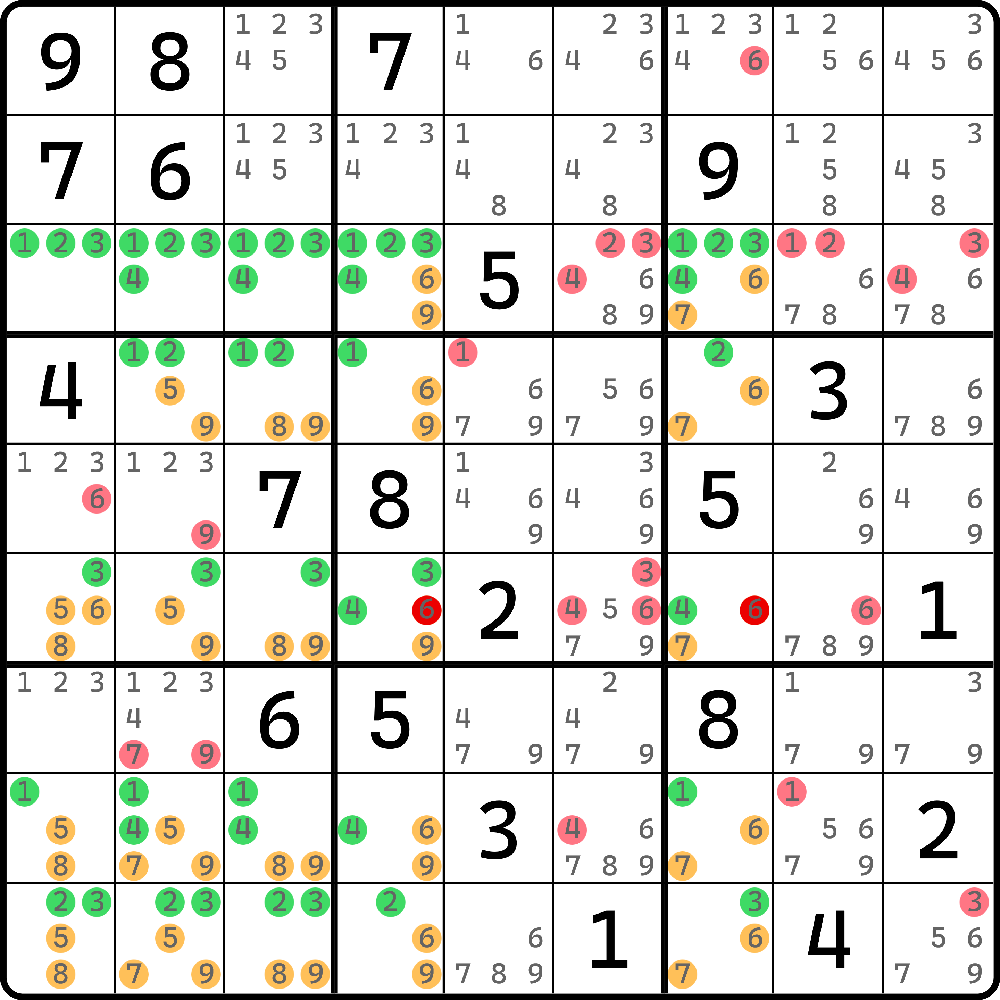

# 网的基本推理

前文的内容我相信已经给各位阐述了一个比较清晰的推理过程。下面我们正式进入这个板块的内容的学习。

## 一个看着就很唬人的题 

在中国的数独论坛里老是流传着这么一道数独题，据说是由芬兰的一位数学家自己研制的数独题目，它具有唯一解，但却无法采用合适的技巧进行解题。

<figure><figcaption>
所谓“世界最难数独题”
</figcaption></figure>

如图所示。这道题被过度抬高，甚至被广泛称为“最难数独题”，一度吓死不少孩子。我们要对题目有一个正确的认知，数独技巧确实并非是万能的，对于越大的结构确实越难以出现；但这个题的存在其实是反倒打破了这一点。这道题会用到一个非常大的结构，比前一节的多米诺环 16 个单元格还要大，但它却是零秩结构。

<figure><figcaption>
网结构
</figcaption></figure>

如图所示。本题要用到 `r12678c2567` 这 20 个单元格。它巧妙就巧妙在这 20 个单元格刚好是矩形的分布，因此非常便于分析。

在前一节的内容里，我们有一个对结构的认知，大概是将结构的涉及的数字进行归纳和分组，让每一个数都发挥出作用，且都用于一个固定的行、列、宫。比如之前的分段融合待定数组里，我们经常会用到同宫里的两个数，它最终会在宫里形成数对结构，只是位置不定。这个题也是如此，不过这个题交织的情况则更为繁琐。这个题里数字的分布应该这么去看：

* 按行
  * `136r1`
  * `18r2`
  * `68r6`
  * `3r7`
  * `36r8`
* 按列
  * `24c2`
  * `257c5`
  * `249c6`
  * `59c7`

可以数数看，这么分配的话，所有的数字全部可以派上用场。按照秩理论的看法就是，强区域一共有 20 个（全是单元格）；弱区域也有 20 个（10 个行上的弱区域，10 个列上的弱区域）。因为本题所有数字均只会被一个强区域和一个弱区域所覆盖，所以均为精确覆盖，故这个结构可以按秩的公式计算得到为 0 的结果。所以这个结构整体是零秩的。

因为是零秩的，所以所有弱区域均可用于删数。对于此题而言，所有 20 个弱区域均可用于删数，于是就可以得到图上的这些位置。

我们把这个纯单元格当强区域，而相关连接用弱区域关联起来构成的零秩结构称为**网**（Multisector Locked Set，简称 MSLS）。这种结构在朴素情况下是矩形形态，比如这个题里的是一个 5 行 4 列的矩形。

## 例子 1：缺了单元格的网 

我们再来看一个例子。

<figure><figcaption>
不够完美的网
</figcaption></figure>

如图所示。这个题只用了 19 个单元格。原本正常的网结构由于 `r1c1` 被提示数占位导致不能再用了。所以这个网结构缺了一个单元格。不过也没问题，因为它仍然符合网结构的定义规则和特征：单元格为强区域，行列宫用弱区域关联所有数字，且零秩仍然成立。这次就不带着大家数了。

## 例子 2：补了单元格的网 

我们再来看一个需要补单元格才能构成网的结构。

<figure><figcaption>
补了 r5c5 的网结构
</figcaption></figure>

如图所示。这个题用了 21 个单元格，而弱区域呢？也是 21 个，所以是零秩的。所以图中所有弱区域都可以用作删数。这个题必须算上 `r5c5` 不是没原因的。如果我们不计算在内，则 20 个单元格必须使用最少 21 个弱区域才能精确覆盖，即使 `r5c5` 不纳入也是如此。此时结构不是零秩，也就无法用于删数；当纳入 `r5c5` 之后，因为它自身只有 4、6、8 三种候选数，也恰好是所在列上的弱区域所用数字，所以恰好可以纳入计算之中，在不破坏结构的情况下使得结构称为零秩结构。哦我们把这种差一点形成网（但还没有构成零秩的结构）通过补充和删掉单元格、篡改弱关系的走向等使其变为零秩的网结构的过程称为对网结构的**修正**（Fix）。

顺带一提，我们趁着这个例子继续介绍一下宫内的弱区域效果。前文给的例子稍微都比较正常，因为都用不上宫的弱区域类型。下面我们来看使用了宫作为弱区域的变体。

<figure><figcaption>
宫弱区域
</figcaption></figure>

如图所示。我们将 `9r46` 的两个弱区域改成 `9b46`。这样数字 9 的覆盖情况并未发生变动（仍然是精确覆盖）的同时，弱区域数量也不会变，所以这种改的方式是可以的。

不过这么改了一下之后，弱区域因为不同了，所以删数就不一样了。此时 `b46` 里别处的 9 就可以用于删数了；相反，因为 9 不再是行上的弱区域，所以行上的弱区域在这个情况下就不能删除了。

我们再来看一个例子。

## 例子 3：带宫弱区域的网 

<figure><figcaption>
带宫弱区域的网
</figcaption></figure>

如图所示。这个例子就自己看了。

## 例子 4：带自噬的网 

可以从前面的例子看出，网结构是可以切换弱区域的类型来达成不同区域的删数的。从秩理论的角度来说，使用不同的弱区域视角去看同样几个数字的分配情况，其实是在构造弱三元组。对于某个或某些候选数而言，构造所谓弱三元组会造成一些特殊用途，例如区块的形成，进而产生特殊删数。下面这个例子就阐述了这一点。

<figure><figcaption>
带自噬的网
</figcaption></figure>

如图所示。这个例子用到了 24 个单元格，是个零秩结构，所以基础删数就不解释了。这里要说的是删数 `r6c47(6)`。

这两个数是怎么删的呢？这其实是跟 `r6c1(6)` 有关。可以看到，我们把它涂色染成了列上的弱区域的配色，也就意味着它是算列上的弱区域的。但是实际上，这个 6 在结构里的同一列上（`r3689c1` 里）也就只出现了一次。反倒是行上 6 出现的频次会多一些。但是按照取数的分配规则，按行去算 6 的位置的话，秩可能就不为 0 了，因为 `r4(6)` 还缺少分配；如果分配了 `r4(6)` 分配了，`c47(6)` 又会变得困难，因为横竖都要取全部的 6，这样还会造成强三元组的情况出现，带来不必要的讨论。

那么我们直接干脆一点，只有 1 个数字 6 也不是不行。那么我们想一想，如果此时 6 按列上看可以，按行上却不行的话，那还有一个情况，就是把它视为宫的弱区域，即 `6c1` 看成 `6b4`，反正 `b4` 也别的位置有 6，也不会因为你选择了宫导致影响到别的候选数的分配。

好的。那么这个 6 既可以视为列上的弱区域，又可以视为宫内的弱区域，此时这个 6 处于弱三元组上。我们不妨讨论它的占位情况。

如果 `r6c1` 占位填 6，则结构少一个强区域 `6n1`，但弱区域会少两个，即这里的 `6c1` 和 `6b4`。原本 6 在弱区域上被算两次，所以弱区域数本身就比强区域数要多一个；但此时强区域数少 1 个，弱区域数少 2 个，两者数量一样了。而其余位置则不存在这种强弱三元组（即都是精确覆盖），故此时结构可按秩公式求得为零秩结构。

如果 `r6c1` 不占位填 6，则可以视为这个单元格不存在候选数 6，而其他数本身就是精确覆盖的。现在弱区域数量会比原来强区域数量少一个。

> 因为弱区域数量少了 `6c1` 和 `6b4`，但此时不占位并不意味着 `6n1` 缺少，这个强区域仍然存在，所以强区域数不变，弱区域数少 2。按数量来算，原来强区域数比弱区域数少 1 个，现在弱区域数直接减去了 2，所以反倒弱区域数比强区域数还少 1 个了。

因为结构为精确覆盖，所以按秩的规则参与计算可得结果为 -1。因为秩小于 0，所以结构变为不合法。这么看起来，`r6c1` 还非得必须填 6 才行了。

是的，所以这个结构有个自噬的结论，即 `r6c1(6)` 这个候选数其实是为真的。不过本题是按删数来涂色的，并不是不知道 `r6c1 = 6` 结论是成立的，而是因为它的本质是利用它同处于两个弱区域的交集上（弱三元组）。而弱三元组在此时发挥的作用并非必须是单一的候选数。只有这种单一候选数作为弱区域时肯定是可以出数的，但如果是两个位置呢？这种其实是看成区块的，所以从本质来看是不能直接出数的。

下面我们来看一个这样的例子。

## 例子 5：带宫弱区域且有自噬的网 

<figure><figcaption>
带宫弱区域和自噬的网
</figcaption></figure>

如图所示。虽然看着复杂，但是这个例子反倒比前面那个例子要好理解一些。基础删数就不说了。直接来看 `r1c89(3)` 的自噬原理。

这个地方，`r3c89(38)` 是比较自由的。你可以选择将这俩看成行上的弱区域，这样结构就能直接成立，因为秩是 0。但是，不难发现的是，如果我们将 `r3c89(38)` 都视为宫弱区域的话，情况就不一样了。

不难发现，本题如果 `r3c89(38)` 里任意一个候选数是弱三元组的话，结构都会有 19 个弱区域、18 个强区域。此时推理将会直接照着前面那个例子的删数规则走——讨论弱三元组的占位状态可得其中一种占位情况直接会造成秩为 -1 的矛盾状态，所以这里 `r3c89(38)` 四个数都是弱三元组，但他们是分开看的，并不是叠在一起的；换言之，你只能看成是 4 个不完全相同的 19 个弱区域、18 个强区域的结构，而不能看成是 1 个 22 个弱区域、18 个强区域的结构。

下一节我们将继续带着大家看一些其他的例子。
