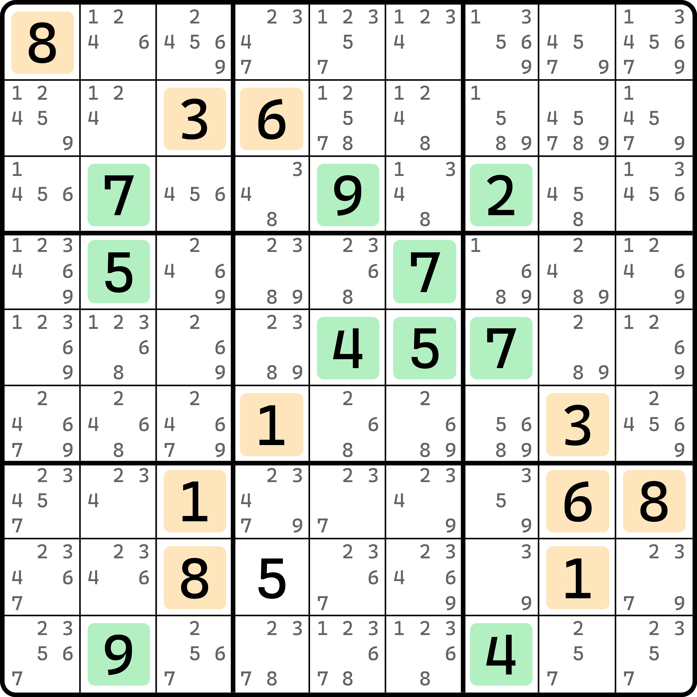
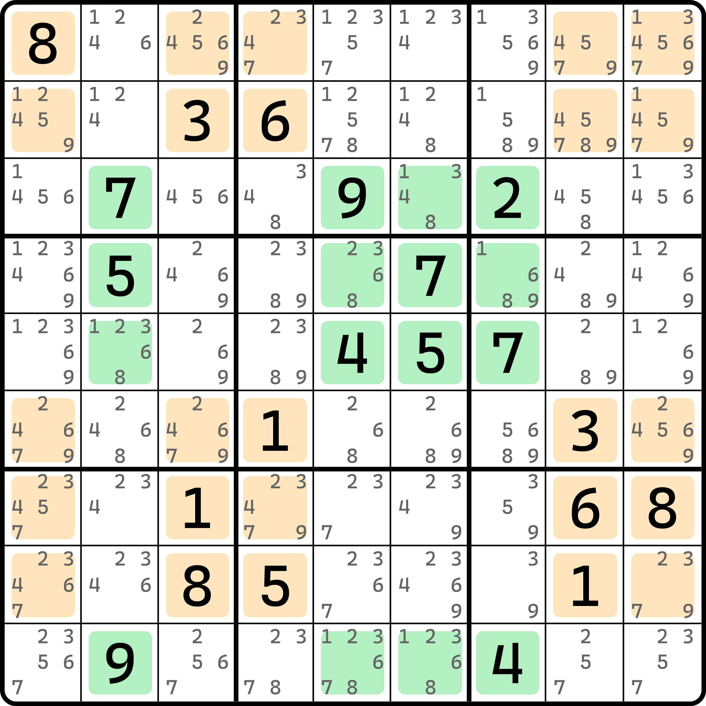

# 网的直观和互补性

之前的内容我们介绍了基础的网的推理方式。今天我们来看点不一样的。

## “双拼”视角 

我们仍然拿之前的例子举例会让你学得更快一些。

### 步骤 1：划分数字 1 到 9 为两组数字 

<figure><figcaption>
还是那道熟悉的题目
</figcaption></figure>

如图所示。数独要用到的是 1 到 9 九种数字类型。我们将其分为两组：1、3、6、8 一组，而剩下的 2、4、5、7、9 则是另一组。

分好组后，我们按行和列划线的方式将他们在盘面上所有的明数出现位置取出。还记得明数吧？就是那些题目上填好了的数字，提示数或填入数。当然，这个题比较特殊，只有提示数会被用到。

划分好了之后，我们可以按图中的方式对选取的分组的数字进行染成两种颜色，染色规则是，同属于一组的被染色，当你确定了这一组数字都出现在了哪些行列之后，就把他全部拿出来，然后无视不属于这一组的数字；另外一组因为数字种类互斥，所以当前一组的出现行列已经定下来之后，后面这一组的就顺理成章地使用互补的这些行列进行染色。

比如这个例子里，我们选取了 2、4、5、7、9 为同一组的数字，而恰好这几个数出现比较频繁的是 `r3459` 和 `c2567` 这些行列。我们就照着这些行列，因为这些行列共有 16 个交点，我们就把这 16 个交点里是 2、4、5、7、9 的所有数字全部用一种颜色进行染色；同理，我们发现 1、3、6、8 则一定是剩下的、不被 `r3459` 和 `c2567` 所覆盖的余下的行列。我们也按此规则将 1、3、6、8 的全部明数提取出来。于是就有了图上这个涂色规则。其中，`r8c4` 属于 1、3、6、8 的领域，但因为染色的数字不涉及 5（这一组没有 5），所以这个 5 被我们忽略了，就不染它了。

### 步骤 2：利用行列交叉进行割补计算 

前一步我们划分了分组也确定了数字的出现情况。下面我们需要一点轻量级的数学公式的计算，这里用到的算法类似于割补技巧（就是之前直观技巧里的那个 LoL）。

我们把绿色这一组 1、3、6、8 进行横向划线，橙色这一组 2、4、5、7、9 进行竖向划线。划线表示的是它的“走向”是按行计算还是按列计算。

显然，1、3、6、8 进行横向划线，整个组一共占用了 4 个行。显然，一个行需要填入一套完整的数字 1 到 9，所以 4 个行就需要填 4 套 1 到 9；如果是竖向划线的另外一组的话，因为它用了 5 个列，所以就是需要 5 套 1 到 9。

因为我们是横向和竖向这么划线的，所以它必然会在盘面上造成一些交点。那么我们把“是否为交点”作为行和列里单元格的属性，那么我们不难有如下这两个式子：

* <mark style="color:green;">4 套 1-9（横向</mark> <mark style="color:green;"></mark><mark style="color:green;">`r3459`</mark><mark style="color:green;">）</mark> = 交叉点 + <mark style="color:green;">横向余下格子</mark>；
* <mark style="color:orange;">5 套 1-9（竖向</mark> <mark style="color:orange;"></mark><mark style="color:orange;">`c13489`</mark><mark style="color:orange;">）</mark> = 交叉点 + <mark style="color:orange;">竖向余下格子</mark>。

这两个式子里，交叉点是一样的，剩下的四个部件不一样。我们拿第一个式子进行移项变换，可以得到这个式子：

* 交叉点 = <mark style="color:green;">4 套 1-9</mark> - <mark style="color:green;">横向余下格子</mark>。

将此结果代入第二个式子。

* <mark style="color:orange;">5 套 1-9</mark> = <mark style="color:green;">4 套 1-9</mark> - <mark style="color:green;">横向余下格子</mark> + <mark style="color:orange;">竖向余下格子</mark>。

因为数字 1-9 的套数是可以进行加减运算的，所以我们将 4 套 1-9 移项到等号左边去。

* 1 套 1-9 = <mark style="color:orange;">竖向余下格子</mark> - <mark style="color:green;">横向余下格子</mark>。

等号右边因为有负号在前，所以交换了下位置。

观察这个式子，用自然语言描述这个话就是，竖向余下的单元格比横向余下的单元格会多出来完整的一套 1-9。

### 步骤 3：利用式子推算结果得到结论 

为了看起来方便，我们不妨把余下格子标注出来。

<figure><figcaption>
余下单元格的视图
</figcaption></figure>

如图所示。我们取出了余下的单元格，其中绿色的是这 16 个单元格，而橘色的是 25 个单元格，从数量上讲，它确实正好比绿色的多 9 个单元格。而从式子上我们还能恰好得到多出来完整的一套 1 到 9 来。

我们数一下数字的排列。绿色的这一组里一共有 10 个明数而且全都是 2、4、5、7、9 这一组的数字，橙色这一组里一共有 11 个明数，除了 `r8c4` 是另一组的数字外其他的也都是来自于 1、3、6、8 这一组的数字。

鉴于橙色这一组单元格更多，我们先看它。橙色一共有 25 个单元格，其中有一个 `r8c4` 较为特殊，除开之后还有 10 个明数。也就是说，余下的 14 个单元格是空格状态。因为橙色这一部分一定要比绿色的部分多一套 1-9 出来，所以我们通过计数的方式，从橙色的这一组单元格里划去一套 1-9 的摆放位置，然后“强行”使得两组涂色单元格都保留 16 个单元格且填数内容一致。

比如说，我们知道橙色是 1、3、6、8 这一组，而 2、4、5、7、9 也得都填进去一个，所以我们先从明数里划去一个 1、一个 3、一个 6 和一个 8。划去谁都无所谓，这里只是考虑用计数来表现“集合上的相等”；接着，我们再从橙色这一组里的空格里选取 4 个位置并划掉（以代表填的是 2、4、7、9），最后划掉 `r8c4` 这个特殊位置（它刚好用来代表填的是 5）。这样划去了 9 个单元格之后，橘色余下的格子必然就和绿色集合里面填充的数字完全一样了。

再次统计数量。橘色现在有 25 - 1 - 4 - 4 = 16 个单元格，其中明数还剩下两个 1、一个 3、一个 6 和两个 8（一共 6 个），空格数量也从原本的 14 个变为了 10 个。你再数数看绿色这一组的明数呢？恰好也是 10 个明数而且还全都是 2、4、5、7、9。这说明什么？因为划去之后的状态要保持等价，即有“橙色这一组 = 绿色这一组”这个式子成立，而橙色划去之后余下的部分压根就没 2、4、5、7、9，能摆进去的位置又刚好容纳全部 10 个来自于绿色这一组的 10 个明数，所以这意味着，橙色这一组里余下的 10 个空格全都必须放入的是 2、4、5、7、9。而算上刚才从橙色的空格里划去了 4 个填一套 1-9 时而意外消失的 2、4、7、9，这样计数后发现，橙色这一组里所有的 14 个空格全都得是 2、4、5、7、9。

同理，那么绿色这一组里的空格填什么呢？请好好思考一下。如果你没有立马反应过来的话，请阅读上一段的内容。

是的！两个 1、一个 3、一个 6 和两个 8 这刚才统计出来的这一组 6 个明数就应该落入绿色的余下 6 个空格之中。这也就是说，绿色的这一组里，空格全都是 1、3、6、8。

所以，整体的结论就是，橙色的空格里删除所有不是 2、4、5、7、9 的数，而绿色的空格里删除所有不是 1、3、6、8 的数。所以，这个题的结论我们就有了。

因为删数结论和之前介绍此题的结论完全一样，所以就再重复不展示了。

可以从前文里看出，这一次我们的计算过程跟候选数没有半毛钱的关系，这便是网结构的特别之处，它是可以使用直观视角得到其结论的。

## 网的互补 

不难猜到，我们之前使用行列方向的方式是可以更换的，所以变换一下就可以得到另一个视角。所以，网结构也是存在互补的。

<figure><figcaption>
网的互补
</figcaption></figure>

如图所示。这就是网结构的两种互补形态下的情况。可以从题里看出，候选数视角下的网结构用到的单元格均落在了我们前文直观视角里的余下单元格和交叉点上。再仔细看看数字分配的关系，比如左图里展示的绿色是 2、4、5、7、9，橙色是 1、3、6、8；而右图里绿色的是 1、3、6、8，橙色的是 2、4、5、7、9。想必你已经知道了其原因，它正是前面直观视角里利用了横向和竖向划线的操作进行两种不同的分配方式得来的两种结果罢了。

网的内容就全部结束了。下面我们将来看看另外一种、类似显隐性互补的效果作用于网结构的技巧。
