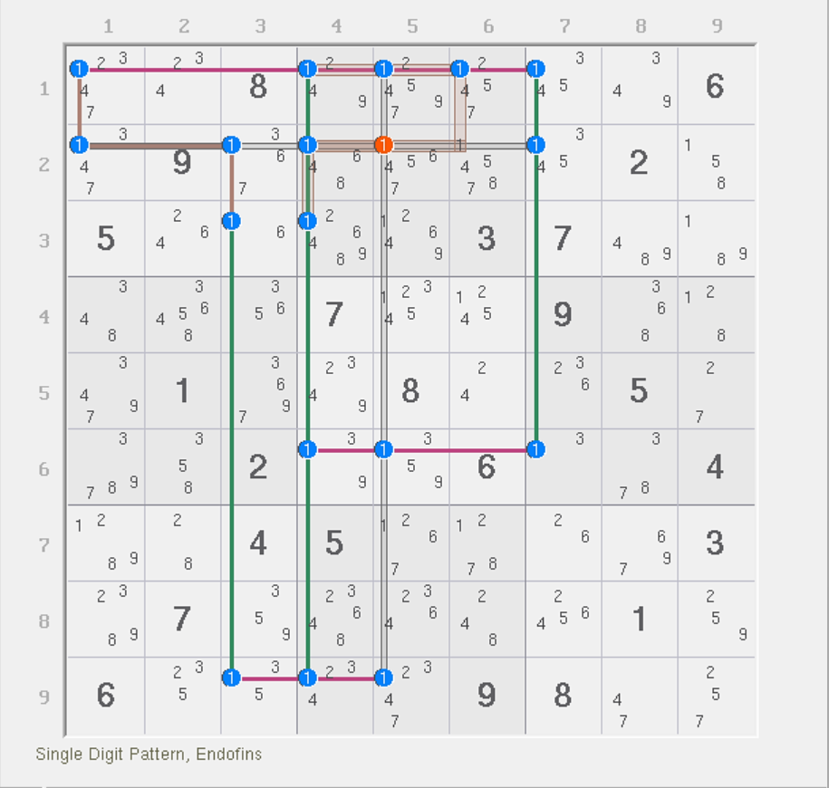
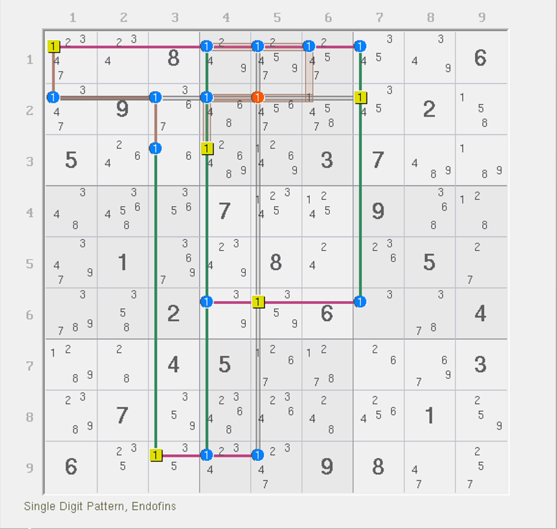

# 复杂结构的秩

今天我们来完整对一个结构进行秩的计算和分析。

## 结构的秩的计算 

### XSudo 对结构的秩的定义 

当你看到一个结构的时候，你需要优先确定强区域和弱区域的数量。而当结构不存在任何的强弱三元组的时候，结构为精确覆盖，这个时候，填充的次数一定是稳定次数的。此时可以直接算出结构的秩。而当如果存在强弱三元组的时候，因为结构的最终填充次数无法确定，所以结构可能填充次数并不稳定，故不能计算秩。不过，我们要分析清楚秩的计算规则，我们这里需要将定义稍加推广。

对于 XSudo 软件里，结构的秩是这么定义的：

我们还是先数出强区域和弱区域的数量，然后通过递归分析后确定了结构的删数有哪些之后，针对每一个删数进行分析。对每一个删数而言，找出可造成此删数的**最小子结构**（Minimal Subpattern），并确定其**子结构**（Subpattern）里可填的最多和最少次数的数字。

**当结构的所有删数所对应的最小子结构在所有的填数情况下，填充次数均是一个定值，则我们可以直接拿此最小子结构的弱区域数减去实际填充次数，得到的差值则等于这个最小子结构的秩。而当这些最小子结构的秩全部是同一个数的时候，我们定义其完整结构的秩等于此数值；否则，整个结构就不存在一个稳定的秩的数值结果，或者说他的秩有多重结果，而这种结构被称为多重秩结构（Multirank Pattern）。**

我们来看一个计算例子。

### 示例 

<figure><figcaption>
还是熟悉的胖姨环
</figcaption></figure>

如图所示。这是之前那个胖姨环。这个结构能删的数字是 2、3、5、9。不过这次按 XSudo 的定义，我们可以得到这个特殊结构的秩的结果，这在之前的定义里是无法计算的。

首先，我们要找到两个删数，每一个删数要形成矛盾的最小子结构。比如 `r6c2(2)`，实际引发此数填入后矛盾是不需要弱区域 `1c5` 的。假设 `r6c2(2)` 为真，我们可以进行一次递归分析，依次得到 `r6c8 = 3`、`r6c1 = 1`、`r6c5 = 9`、`r2c5 = 5` 这些数；然后当 `r6c1 = 1` 的时候，走 `1b7` 这个强区域分支可以得到 `r9c5 = 5`。此时引发矛盾。可以看出，这个推理过程是不需要 `1c5` 的参与的。

用到的强区域看的是你在假设的过程之中，要么单元格里只剩下一个数，要么同一个行列宫里只有唯一一处可以填这个数字的情况。显然，刚才的出数逻辑里我们用到了全部的强区域（一共 6 个）；而弱区域发挥作用的方式看的是你排除过去的效果。例如你在 `r6c1` 填了 1，顺着结构往下走 `1b7` 强区域造成影响的时候，你用到了一次 `1c1` 的弱区域。类似这样计算的话，确实 `1c5` 并未参与到结构之中，因此整个结构只用了 7 个弱区域就可以删除掉这个 `r6c2(2)`。

同理，如果你要删除 `r4c5(9)`，最小子结构也是 7 个弱区域（这次 `1r6` 则不需要）。视图拆解开来是这样的：

<figure><figcaption>
视图拆解
</figcaption></figure>

如图所示。所以，这两处删数能得到的最小子结构，两个子结构都是 6 个强区域和 7 个弱区域构成，因此这两个子结构的秩都是 1。又因为这个结构整体所有删数的对应子结构的秩全部都相同（两个都是 1），所以 1 便是这个结构的秩。

## 有多重秩的结构 

什么时候结构会有多重秩呢？当删数的来源不同的时候。比如下面这个之前讲到过的鱼结构，他就是一个多重秩的结构。

<figure><figcaption>
复杂鱼
</figcaption></figure>

如图所示。这个鱼有 4 个删数，删数是分成了两种不同的情况。

<figure><figcaption>
视图拆解
</figcaption></figure>

如图所示。当你要删除 `r4c7(4)` 的时候（左图），最小子结构是不需要 `1c1` 这个强区域的，因为到不了这里，结构就能矛盾；而如果你要删除 `r5c568(4)` 的其一的时候（右图），最小子结构则可同时去掉 `4b6` 弱区域和 `4c8` 强区域。

由于原结构是 5 个强区域和 5 个弱区域，所以造成 `r4c7(4)` 删数的时候的秩等于 1（5 - 4），造成 `r5c568(4)` 删数的时候的秩等于 0（4 - 4），所以这个结构的秩是不存在稳定结果的，或者说他存在二重秩 0 和 1。

## 最小结构的概念 

当一个结构的所有强弱区域都无法去掉的时候，这种结构被定义为**最小结构**（Minimal Pattern）。从上述的秩的定义来看，一个结构是最小结构当且仅当它的所有删数造成的子结构和它自身相等（使用的强弱区域全部一样，不多不少）。例如，下面这个结构就是一个最小结构。

<figure><figcaption>
最小结构示例
</figcaption></figure>

如图所示。这个结构的所有删数的最小子结构均为它本身，所以它是一个最小结构。这个题还比较特殊，整个结构的秩为 0，因为它的全部删数的最小结构都需要用到全部 6 个强区域和 6 个弱区域。

但是请注意，这只是这个例子。最小结构的秩不一定都是 0。例如普通链，链的头尾造成删数时，删数会被两个弱区域覆盖，所以一定会比强区域数多一个。而它作为唯一的删数，显然会同时用到全部的强弱关系用来推算并得到矛盾，因此链是最小结构，但它的秩应为 1 而不是 0。

另外，烟花数组也是零秩结构，也是最小结构。

<figure><figcaption>
烟花三数组也是最小结构
</figcaption></figure>

如图所示。不过要注意的是，实际上这个结构是用不上 `3c9` 或者说 `3b3` 这个强区域的，实际上这个结构的强弱区域数都是 5。这一点之前是为了补齐 1、2、3 结构构成数组的设定才加上的，它是冗余的强区域。

## 判断结构的冗余性 

既然有了最小子结构的定义和完整的处理流程后，我们现在就可以知道如何定义出一个结构的冗余强弱区域了。

如何判断一个强弱区域是冗余的呢？这个强弱区域是冗余的，当且仅当它的全部删数对应最小子结构都可以不使用它。比如这个例子里，你在推算图中全部的删数时，都用不上 `3c9` 这个强区域，所以它是冗余的，可以去掉。

不过要注意，这里说的是全部情况。如果有至少一种删数对应的最小子结构会用到它，那么它都不叫冗余的。它只是在其他一些情况里可能不使用而已。

## 练习题 

下面给各位一道题留作练习。

<figure><figcaption>
练习题
</figcaption></figure>

如图所示。该结构为正确结构，请判断此结构的如下一些信息：

1. 结构的强弱区域数量都有多少个？
2. 结构的删数有哪些？
3. 结构的零秩弱区域有哪些？
4. 结构的每一个删数对应的最小子结构的秩都是多少？
5. 结构是否是多重秩结构？是否是最小结构？

请在思考完成后参考后面的答案。

***

答案如下：

1. 8 个强区域和 10 个弱区域
2. `r6c2` 里的非 4、7、8 的候选数和 `r6c7` 里非 7、8 的候选数
3. `6n27` 这两个
4. 均为 2。这个结构是最小结构，意味着每一个强弱区域都会在所有情况下派上用场
5. 不是多重秩结构，但是是最小结构
