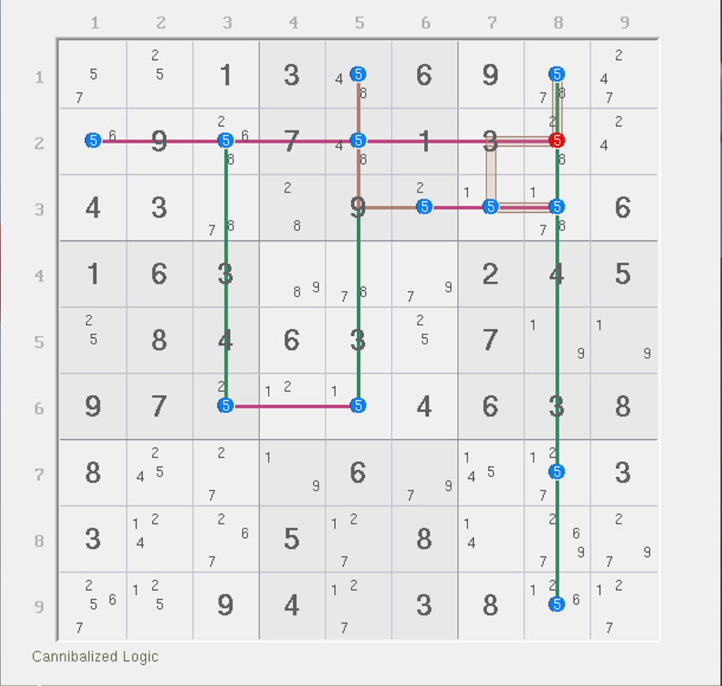
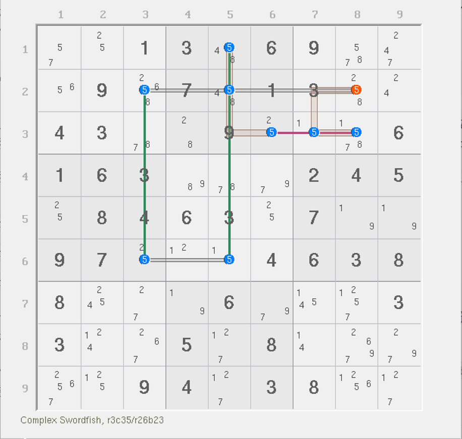
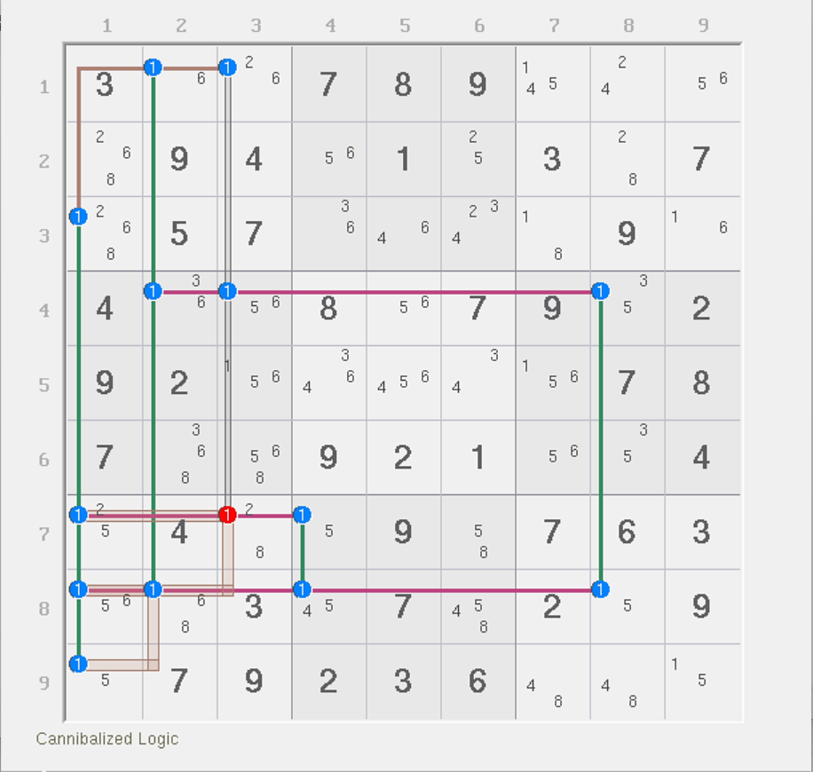
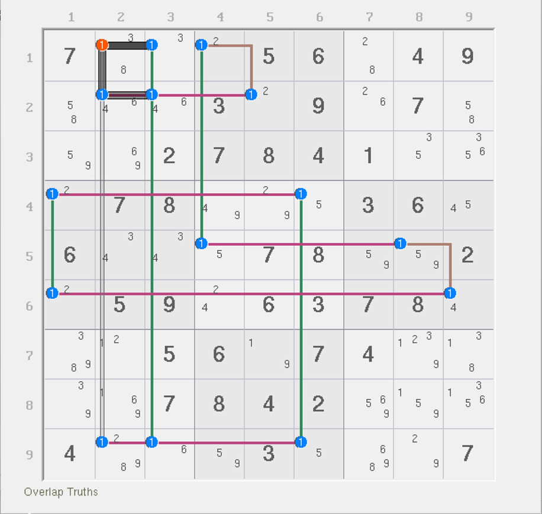
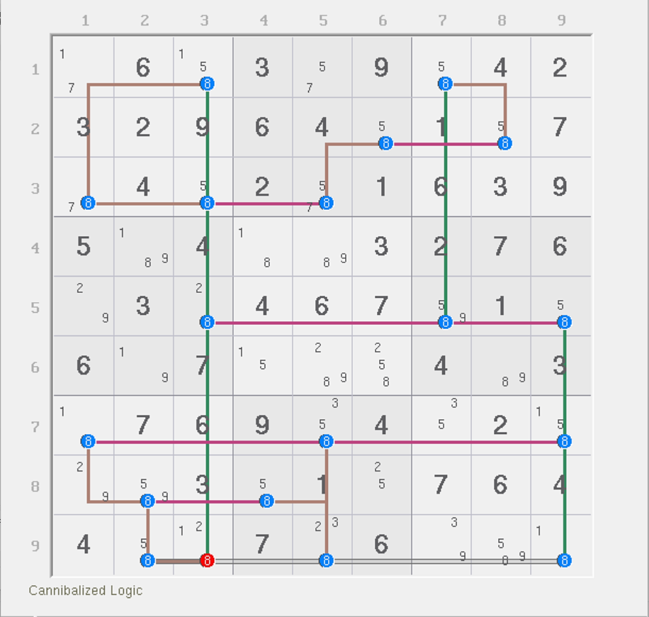

# 守护者的秩的修正

秩的修正说起来还是比较复杂的。之前的例子我们都看到如何针对一个正确结构对秩的结果进行修正计算。下面我们来看守护者这种秩本来就为负数的结构在参与到结构里如何计算秩。

## 引例 <a href="#beginning-example" id="beginning-example"></a>

<figure><figcaption><p>守护者</p></figcaption></figure>

如图所示。这是一个守护者的模式。它的删数是 `r2c8 <> 5`，守护者是 `r179c8`、`r2c15` 和 `r3c7` 这几个。

怎么算秩呢？

按照基础的推算规则，这个题有 7 个强区域，但只有 1 个弱区域。直接算秩的话这得按 -6 来算。这显然有问题。所以我们要更本质的推算规则。

首先，如果我们不看守护者的话，整个环路是奇数长度的，对吧？那么我们试着想一想。按照之前分析秩的填充规则，一个奇数长度的环路，我们只能填 $$\frac{n - 1}2$$ 次这个数，其中 $$n$$ 是环的长度。对于此题而言，因为 $$n = 7$$，所以我们可以往环路上安插 $$\frac{7 - 1}2 = 3$$ 个数进去。

接着，我们将这个环路造成删数的两头改成弱区域。比如说这个题的环路是

```
r2c3 -> r6c3 -> r6c5 -> r1c5 -> r3c6 -> r3c8 -> r2c8 -> r2c3
```

我们把删数 `r2c8` 前后两个节点 `r2c3` 和 `r3c8` 导向它的这两个改成弱区域，其他的 5 个则从 `r2c3` 开始，按强弱交替的形式进行传递，这样我们就有了一条同数链：

```
5r2c3=5r6c3-5r6c5=5r1c5-5r3c6=5r3c8
```

注意，此时我们是忽略了外围的那 6 个守护者候选数的，所以它并不是真正成立的同数链的链路，只是这么描述一下。因为前一节我们说过，同数链属于链，链的秩为 1，所以这条改写过来的同数链是按 1 的秩计算。

接着，我们纳入守护者。我们把这个同数链里所有强链关系里造成影响的“鱼鳍”给提取出来。比如说，这个同数链有三个强链关系：

* `5r2c3=5r6c3`：没有诞生鱼鳍；
* `5r6c5=5r1c5`：`r2c5` 是鱼鳍；
* `5r3c6=5r3c8`：`r3c7` 是鱼鳍。

也就是说，这个链路里有 2 个鱼鳍 `r2c5` 和 `r3c7`。因为鱼鳍同为假的时候，这条同数链才能成立，那么删数才能成立，因此鱼鳍相当于也会往删数上造成额外的排除效果。

那么我们计算秩的时候，需要将鱼鳍纳入计算。因此，到删数的地方，一共有 `5r2`、`5b3` 要额外添加进来。算上同数链自身造成删数的两头弱区域 `5r2`（这个是重复的）和 `5b3`（也是重复的），所以整个结构有 4 个弱区域和 3 个强区域构成。

<figure><figcaption><p>守护者等价结构</p></figcaption></figure>

所以，这个结构的秩是多少呢？是的，4 - 3 = 1。当你在删数位置上填数后，两头弱区域会直接消失，但强区域不会减少，因此秩从 1 变为 -1，造成矛盾。

这就是如何修正守护者的秩的方法：**将环路里其删数所在的两端（前后两个节点）改成弱区域，然后余下部分按强弱交替传递的方式改成同数链，然后将途中全部强链关系里影响成立的“鱼鳍”提取出来，单独往删数上引出一个弱区域。最终统计强弱区域数量即可。**

## 例子 <a href="#examples" id="examples"></a>

请自行推算下面这些结构的秩。

<figure><figcaption><p>例子 1</p></figcaption></figure>

如图所示。

<figure><figcaption><p>例子 2</p></figcaption></figure>

如图所示。

<figure><figcaption><p>例子 3</p></figcaption></figure>

如图所示。
