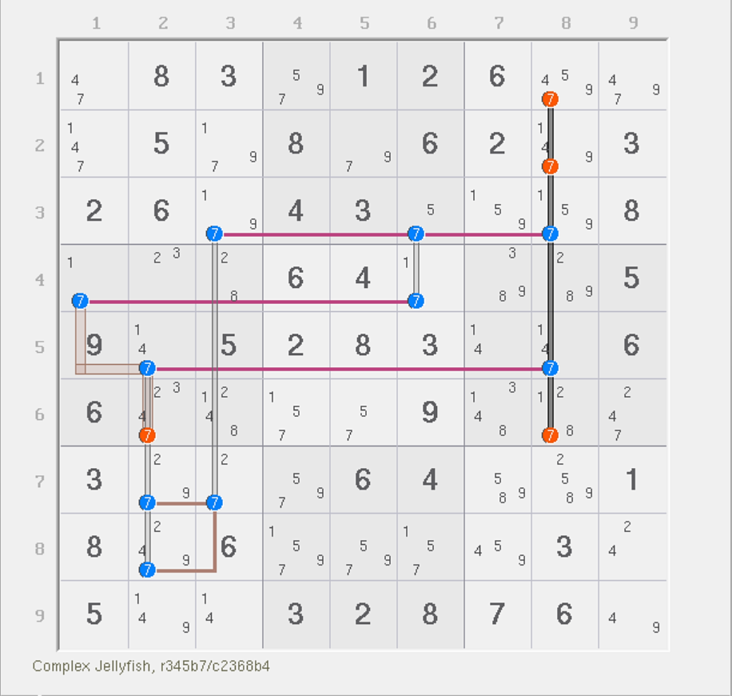
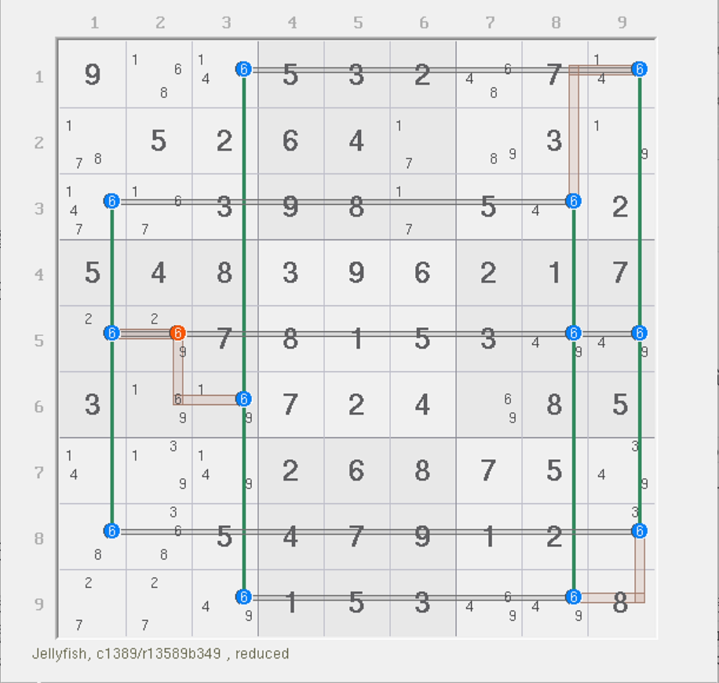
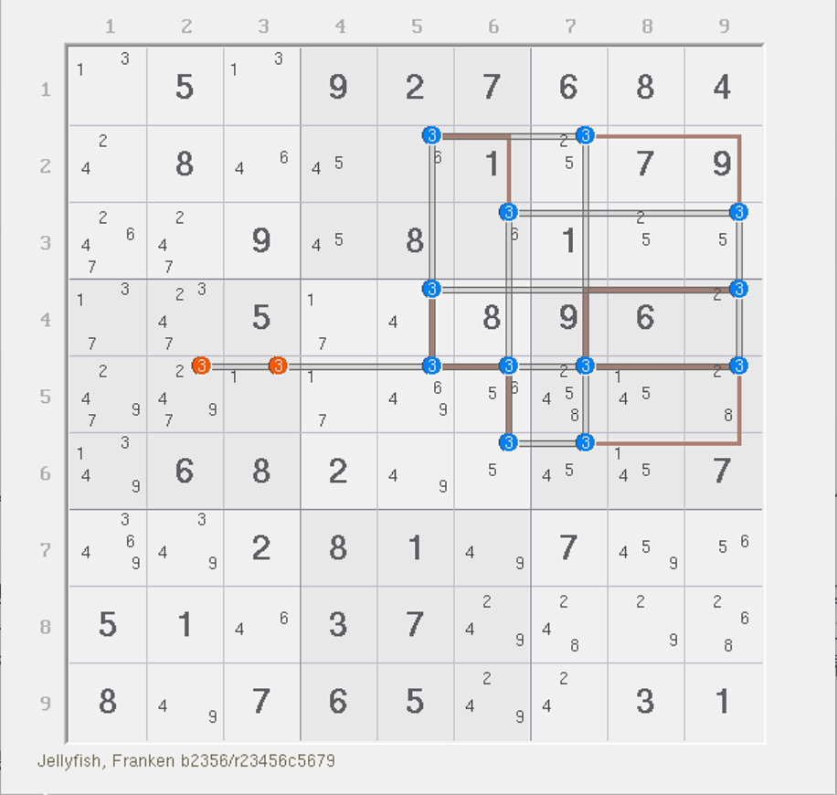
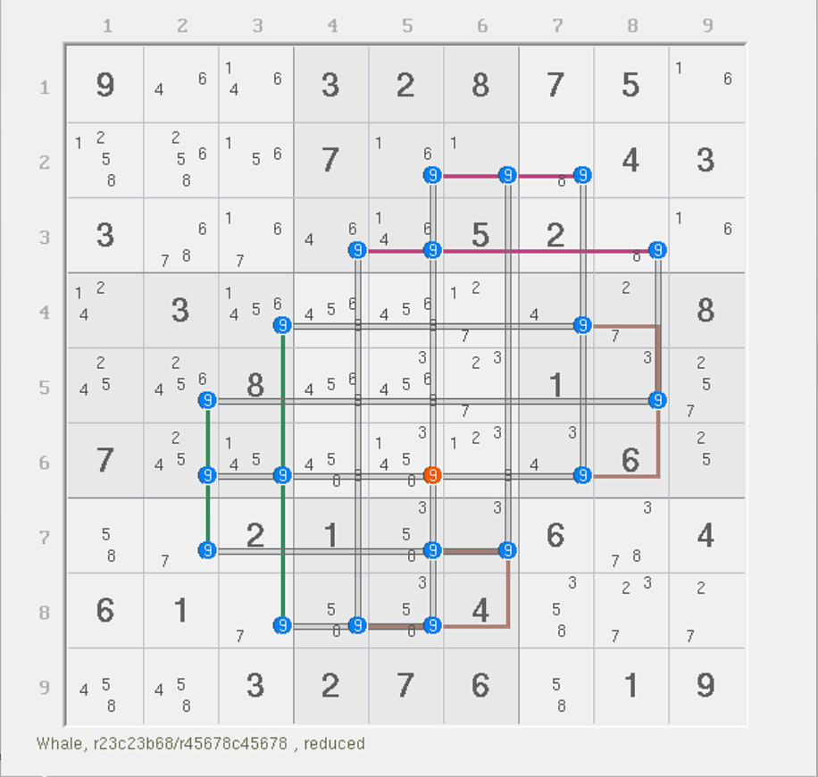
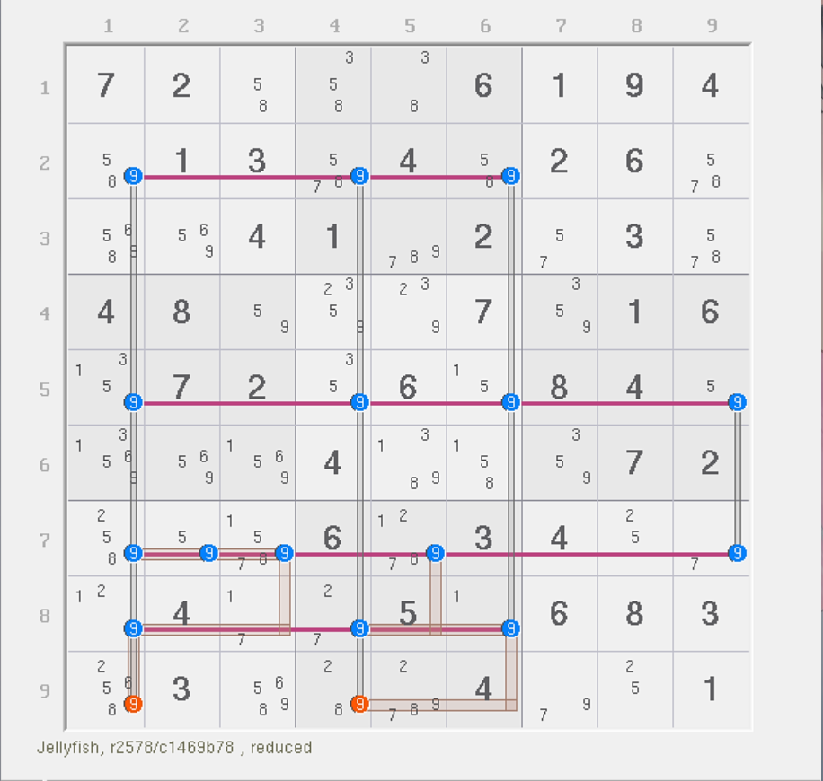
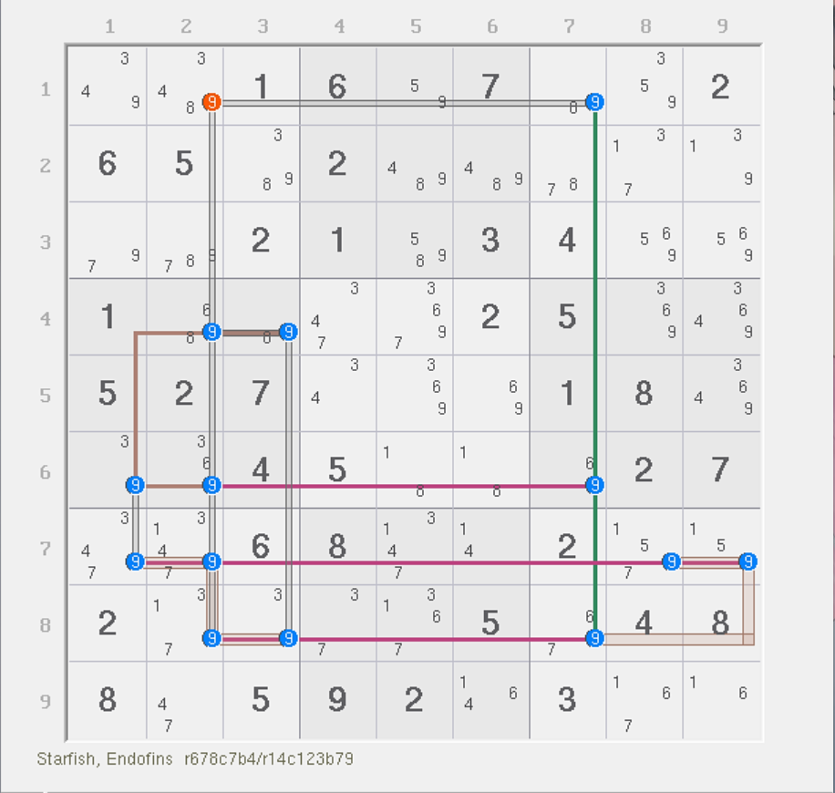
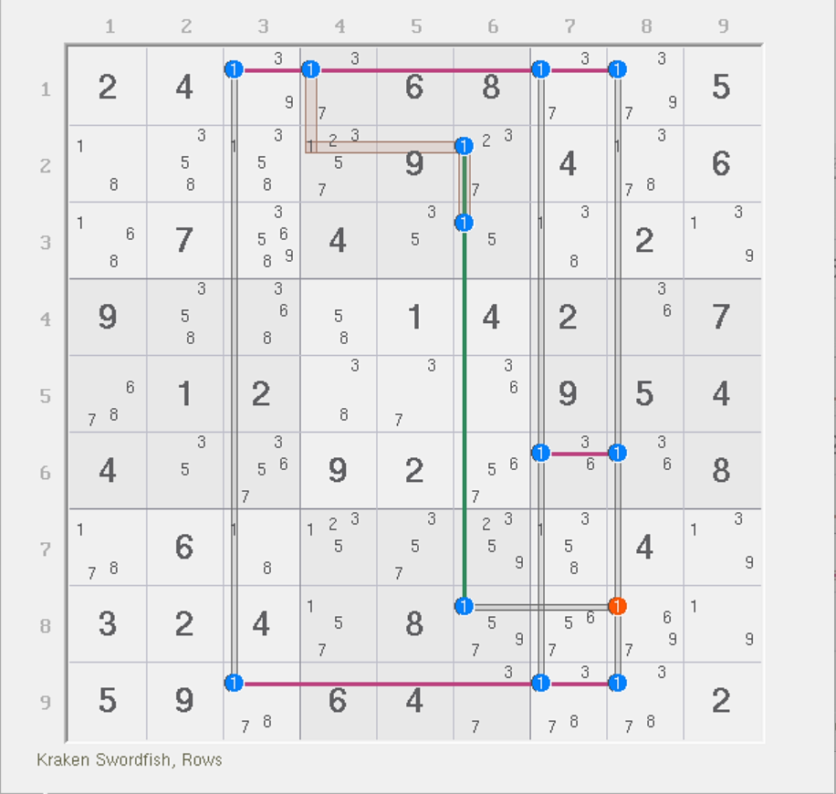

# 不饱和鱼

前面我们介绍了鱼的基本推理，也介绍了复杂鱼的推理方式。不过仔细观察不难发现，那些鱼结构的强弱区域数量是一样多的，所以难点几乎都卡在找鱼鳍上面。

本篇内容介绍的是弱区域比强区域多的鱼的类型。这些鱼将无法直接使用基础的强弱三元组假设（例如鱼鳍和自噬）直接造成删数。对于这种强弱区域数量不一样多的鱼，我们称为**不饱和鱼**（Unsaturated Fish）。

## 利用递归分析 

<figure><figcaption>
4/5 鱼
</figcaption></figure>

如图所示。它有 5 个弱区域，4 个强区域，是宫内鱼；结构内部只有 1 个弱三元组 `r5c2`，其他候选数均为精确覆盖。

对于删数 `r6c2(7)` 而言：

* 如果弱三元组 `r5c2` 占位，则直接造成删数 `r6c2 <> 7`；如果 `r5c2` 不占位；
* 如果弱三元组 `r5c2` 不占位，强区域 `7r5` 会让 7 出在 `r5c8` 上，于是余下的候选数仍然无法继续推理，此时需要继续分情况讨论：
  * 如果 `7r3` 出 7 在 `r3c3` 上，则可以得到 `7b7` 里出 7 在 `r78c2` 上，形成 `r6c2 <> 7` 结论；
  * 如果 `7r3` 出 7 在 `r3c6` 上，则可以得到 `7r4` 里出 7 在 `r4c1` 上，同宫也可以形成 `r6c2 <> 7` 的结论。

对于删数 `r126c8(7)` 而言：

直接假设 `7c8` 不是零秩区域（或者说让 `r126c8(7)` 其一成立导致 `r35c8` 没有候选数 7），于是余下结构有 4 个强区域和 4 个弱区域，`r5c2` 仍是弱三元组，其他候选数精确覆盖。但很明显的是，因为此时 `r5c2` 是弱三元组的同时结构的强弱区域数相等，所以弱三元组会变为自噬，所以此时会有 `r5c2 <> 7`。此时，由于 `7c8` 不存在的缘故，7 在 `r6` 将没有位置填数，直接造成矛盾。所以 `7c8` 必须存在。故 `7c8` 为零秩弱区域，删数成立。

> 为什么强弱区域数相等的时候弱三元组会变为自噬呢？因为弱三元组占位会同时使得两个弱区域和一个强区域消失，而弱区域数减去强区域数才是秩。弱区域数减少得更多，所以结果会比原来的 0 要更小，于是直接变为负数造成矛盾。

这个题有 4 个强区域和 5 个弱区域，我们可以简单记作 4/5 鱼。

## 利用三顺一逆 

不只是递归分析，我们还可以借用之前的三顺一逆来对结构进行特殊分析，这样可以简化不少讨论。

### 例子 1：4/8 鱼 

<figure><figcaption>
4/8 鱼
</figcaption></figure>

如图所示。本题是 4/8 鱼。别看弱区域数量多很多，就觉得它讨论起来很麻烦。实际上这个题有一个比较轻松的得到矛盾的方式。

如果 `r5c2 = 6`，则 `r5c189` 和 `r6c3` 不能填 6。此时结构只剩下 8 个位置可填。仔细观察一下，这似乎是之前守护者的构型。是的，“三顺一逆”。三顺一逆的构型意味着你填数的时候内部会存在奇数长度的环路。之前说过，奇数长度的环意味着你填充数字的时候不论如何都有造成同一个区域填充相同数字的矛盾。所以，余下结构直接可以不看了，这里就可以得到其矛盾。

所以，`r5c2 <> 6` 是本题的结论。

这题利用的是守护者导致题目填充数字矛盾的现象，而不需要递归分析。

### 例子 2：4/9 鱼 

<figure><figcaption>
4/9 鱼
</figcaption></figure>

如图所示。本题是 4/9 鱼。和前面那个题一样，我们这次讨论的点在 `r5` 上。

如果 `r5c5679` 都没有 3（即结构不要 `3r5` 这个弱区域）的话，那么此时余下的结构会变为一个三顺一逆的错误构型，于是造成矛盾，所以 `3r5` 直接变为零秩区域，可用于删数。

这题有趣的地方在于，除了 `3r46` 以外，所有弱区域都是零秩的，只不过删数只有图上这俩。各位可以看一下。

### 例子 3：6/10 鱼 

<figure><figcaption>
6/10 鱼
</figcaption></figure>

如图所示。这是一个 6/10 鱼，弱区域都到 10 个了，太恐怖了。这题也是一样，但是因为它长得好看，所以给各位看一下。

## 复杂例子 

再来看一些其他的例子。这些例子就自己看了。

### 例子 1：4/6 鱼 

<figure><figcaption>
4/6 鱼
</figcaption></figure>

如图所示。这是个 4/6 鱼。

### 例子 2：5/7 鱼 

<figure><figcaption>
5/7 鱼
</figcaption></figure>

如图所示。

### 例子 3：4/5 鱼 

<figure><figcaption>
4/5 鱼
</figcaption></figure>

如图所示。
