# 带有解鱼的环

之前我们介绍过解鱼的内容，而在包装的篇章里我们也说过外部环的逻辑。如果这两个东西结合起来的话，会是什么样的东西呢？

## 例子 1：解鱼外部环 <a href="#example-1" id="example-1"></a>

<figure>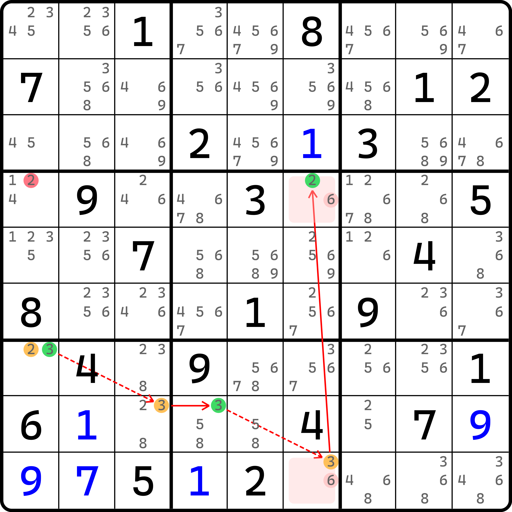<figcaption><p>一个链，但只能删 1 个数</p></figcaption></figure>

如图所示。这个盘面里我们可以随意找出一个链，但是这个链只能删 1 个数，所以干脆不用它。我们还是来看看用解鱼构造环的逻辑能干啥。

我们现在可以找到一个解鱼结构：

<figure>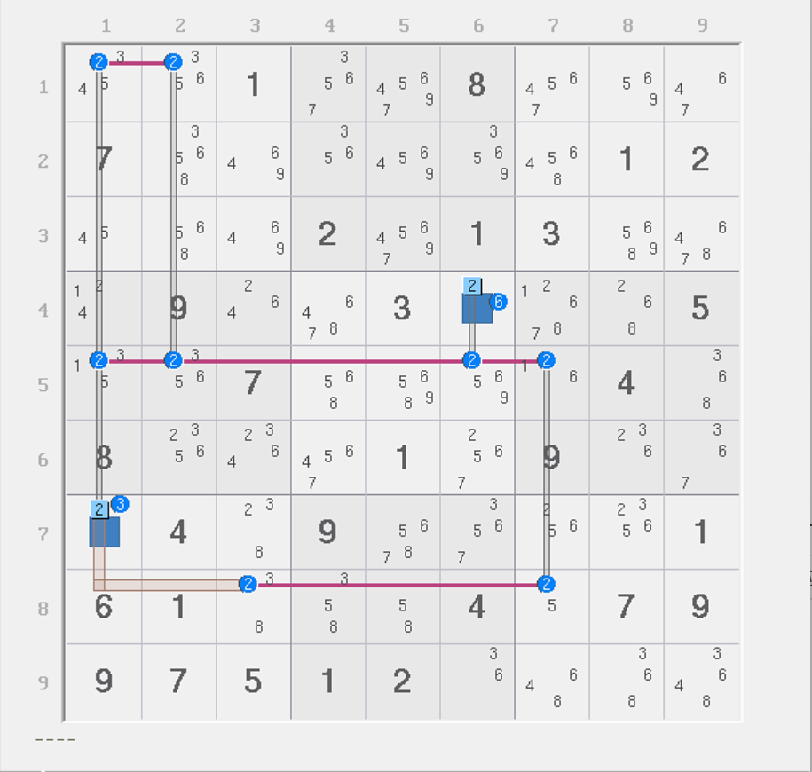<figcaption><p>解鱼结构，构造弱链关系</p></figcaption></figure>

如图所示。可以看到，这个关于 2 的解鱼结构的强区域是 `2r158`，弱区域是 `2c1267` 和 `2b7`，是 3/5 鱼。但是这个地方有个诡异的情况：数字 2 似乎是不同真的状态。一旦 `r4c6(2)` 和 `r7c1(2)` 同真之后，`2c16` 和 `2b7` 三个弱区域全部消失，强区域一个没少，于是 3/5 鱼会变为 3/2 的情况，而余下的候选数均为精确覆盖，所以结构变为矛盾形态。所以这两个 2 不同真，即 `2r4c6-2r7c1`。

于是，利用此构造出来的弱链关系（或者说虚拟弱区域），我们会有这样的结构：

<figure>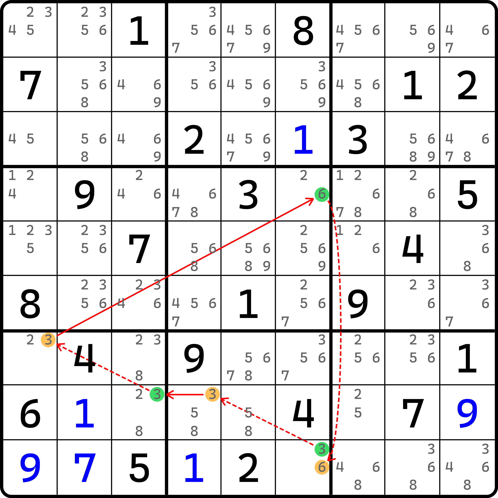<figcaption><p>利用 3r7c1=6r4c6</p></figcaption></figure>

如图所示。这样我们就可以构成一个环，并利用上这个构造出来的强链关系。

等会！这不是强链么，怎么出来的？其实很简单，因为刚才我们知道 `r4c6(2)` 和 `r7c1(2)` 不同真，所以 `r4c6(6)` 就和 `r7c1(3)` 显然不同假。因为这两个单元格是双值格，只要这两个节点同假，则立马会让 `r4c6` 和 `r7c1` 同时填 2，于是这俩 2 就同真了。这不就违背了刚才我们得到的不同真的结论了嘛。

那么来看删数。这个题怎么删呢？我们利用之前的逐步分析。我们这里构造的强链关系利用了 3/5 的鱼结构（实际上是 3/6 鱼，解鱼构造出的虚拟弱区域要算进去的话就是 6 个弱区域），怎么用的呢？

```
r7c1(3) 假
  => r7c1(2) 真
  => r4c6(2) 假（解鱼得到的）
  => r4c6(6) 真
  => ...
```

然后环路后续就串起来了。所以，整个环路可以用于删数的除了基础的弱链关系外，还有解鱼的弱区域可以用。

<figure>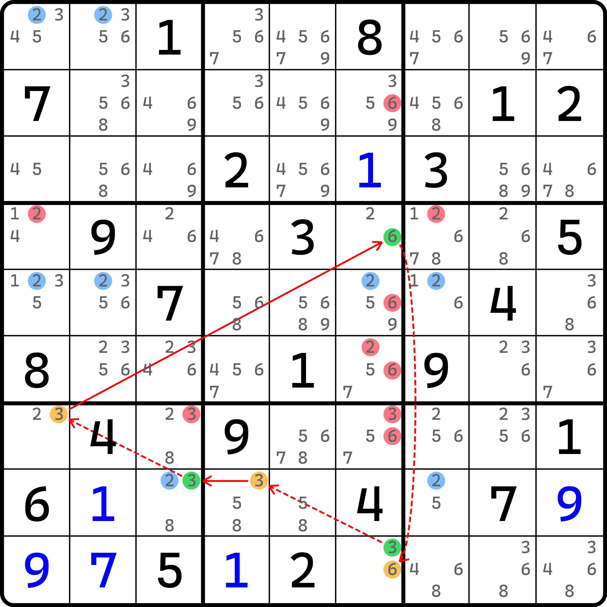<figcaption><p>解鱼外部环，删数</p></figcaption></figure>

如图所示。这是这个环的所有删数。其中 3 和 6 都是弱链关系得到的，剩下的 2 的删数都是解鱼的删数。

首先是 `r4c1(2)`。显然它成立。从之前的链就看得出它是可以删的。余下两个 2（`r4c7(2)` 和 `r6c6(2)`）随意假设其中一个为真，鱼结构都会矛盾。尤其是注意 `r4c6(2)` 和 `r7c1(2)` 这两个 2 的特殊性。解鱼得到的是它俩不同真，而实际上最开始给的那个链并非只是敲门砖，它暗示了这两个 2 还能不同假，所以这两个整体是一真一假的状态。

我们把利用解鱼结构构造虚拟强弱区域的方式，进而用于构造外部环的特殊形式称为**解鱼外部环**或**解鱼大环**（External Loop with Jye's Fish）。

## 例子 2：动态解鱼绽放环 <a href="#example-2" id="example-2"></a>

<figure>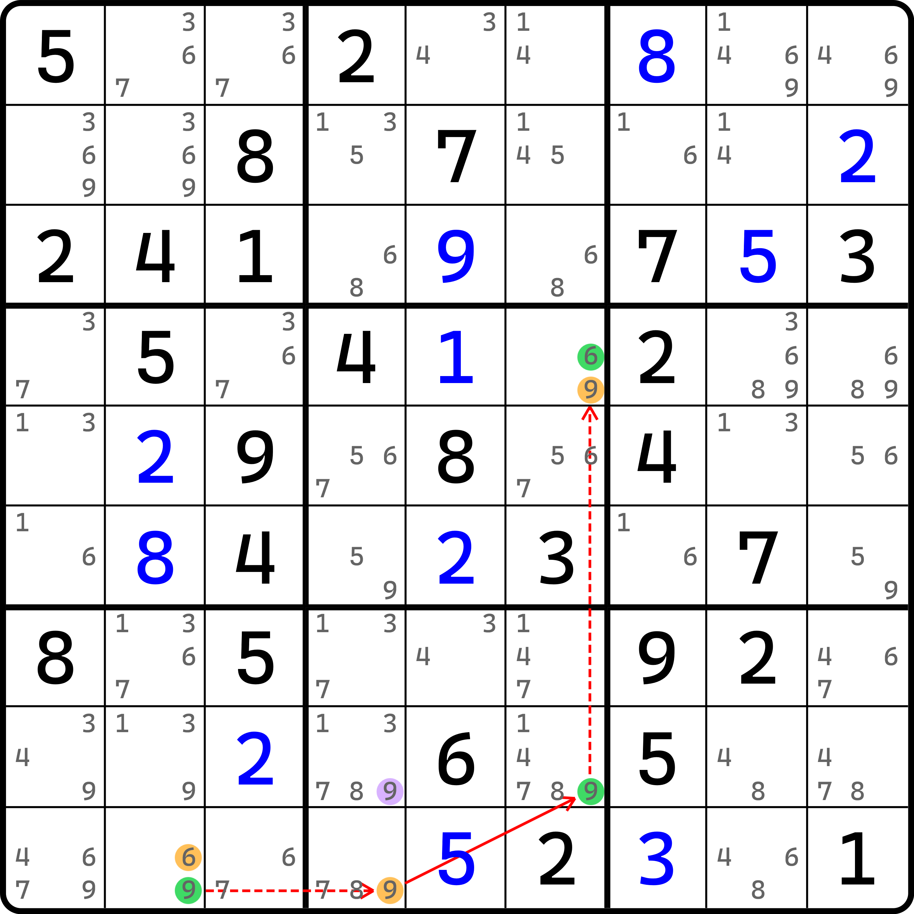<figcaption><p>毛刺为假的强制链</p></figcaption></figure>

如图所示。我们将 `r8c4(9)` 视为毛刺。将其设为假的时候，我们可以构造图中的强制链，这样可以得到头尾 `6r9c2=6r4c6` 的强链关系。于是，毛刺为假的时候，因为这个强链关系，我们还能构造出一个解鱼结构得到如下的删数：

<figure>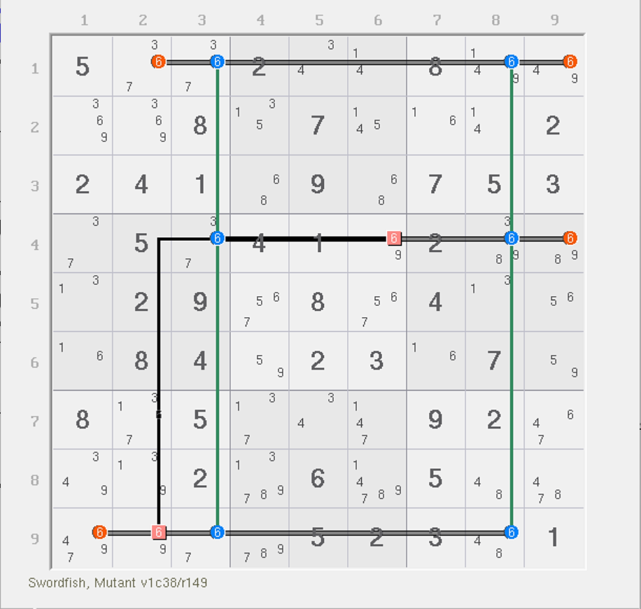<figcaption><p>毛刺为假构成的解鱼结构</p></figcaption></figure>

如图所示。这样我们有这样的一些删数。先别急。我们来看毛刺为真的情况。

<figure>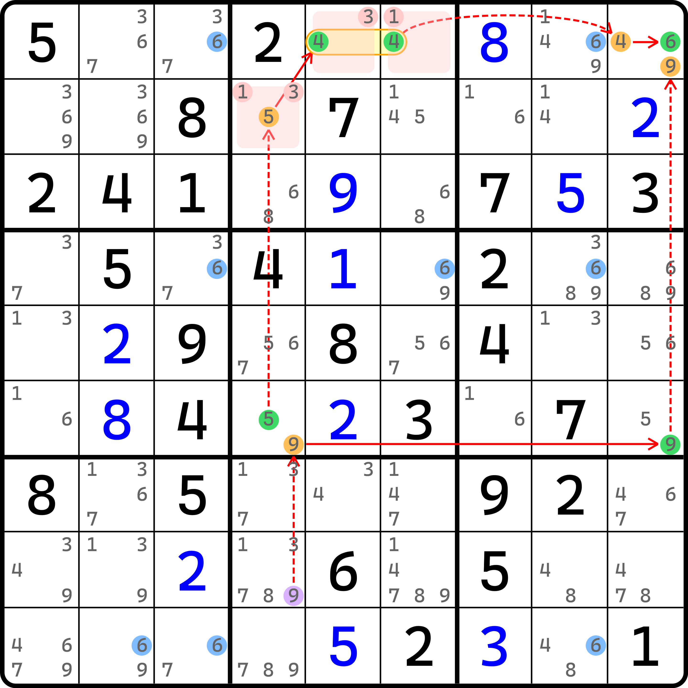<figcaption><p>毛刺为真得到绽放现象</p></figcaption></figure>

如图所示。当毛刺为真的时候，我们有上面这个动态链，从 `r8c4(9)` 出发得到 `r6c4(9)` 为假，于是走两个分支，分别得到 `r1c9(4)` 为假和 `r1c9(9)` 为假。于是，汇入到一起得到 `r1c9(6)` 为真的结论。

请注意。`r1c9(6)` 是另外一个情况（毛刺为假）里构造出来的解鱼结构的删数的其中一个。我们之前说过一点，当毛刺为假时形成的删数我们称为预备删数，这些删数不能直接删去，因为它只是毛刺为假的情况才能造成的删数结论。但是，当毛刺为真的时候，如果我们能有一条链可以得到预备删数为假的情况，则说明什么？说明它绽放了。

这是之前“毛刺回预备删数”的绽放视角。所以，这是一个绽放环。那么，这个环的删数有哪些呢？因为这涉及动态链，所以分析会麻烦一些；但是我们只需要记住一点即可：因为是动态链，所以你无法确保动态链走了哪个分支，也就意味着在动态链的完整链路里，只有分支上的弱链关系不能用来删数。所以，这个题的删数只有开头那一截：`9r8c4-9r6c4` 这一截弱链关系并不是分支的部分。

于是，删数就可以得到了：

<figure>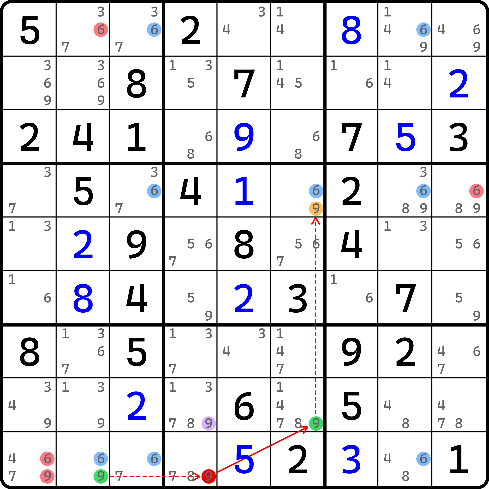<figcaption><p>解鱼绽放环，删数</p></figcaption></figure>

如图所示。图中这些就是解鱼绽放环的删数了。除了解鱼给的三处 6 是基础的删数以外，刚才说到的 `9r8c4-9r6c4` 的弱链可以删掉 `r9c4(9)`。而初始引出的 `9r9c2-9r9c4` 也别忘了用来删数：`r9c1(9)` 也可以删。

当然了，这么删了之后 `r9c2(9)` 可以直接出数，所以甚至可以得到 `r9c2 <> 6` 的结论；而如果不看这里的话，当 `r9c4(9)` 删数后，`b8` 会形成关于 9 的区块，以至于 `r8c12 <> 9` 的结论也可以成立。不过这些就不多说了。是的，图中 `c6` 这里还有个弱链关系，不过它遗憾在没有删数。

## 例子 3：双解鱼外部环 <a href="#example-3" id="example-3"></a>

最后我们来看一个神奇的例子。

<figure>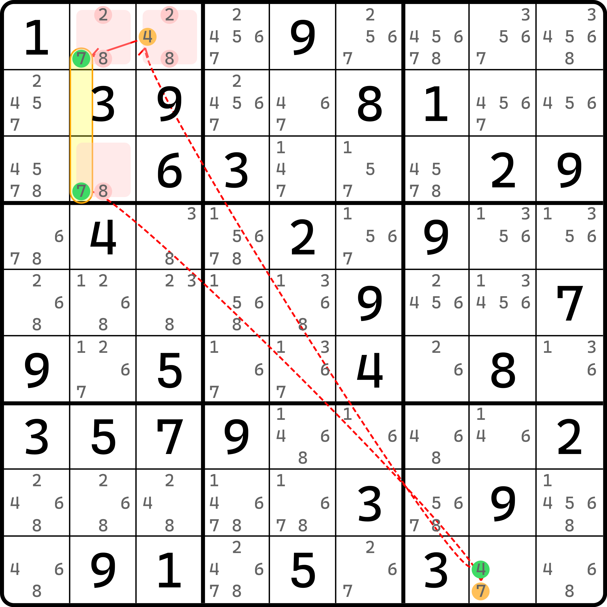<figcaption><p>双解鱼外部环</p></figcaption></figure>

如图所示。这是一个环。这个环神奇的地方是两个弱链关系都是跨特别远的连线，根本看不出来是怎么得到的。不过没关系，我们来看看到底怎么得到他们。

先来看 4 的弱链关系。

<figure>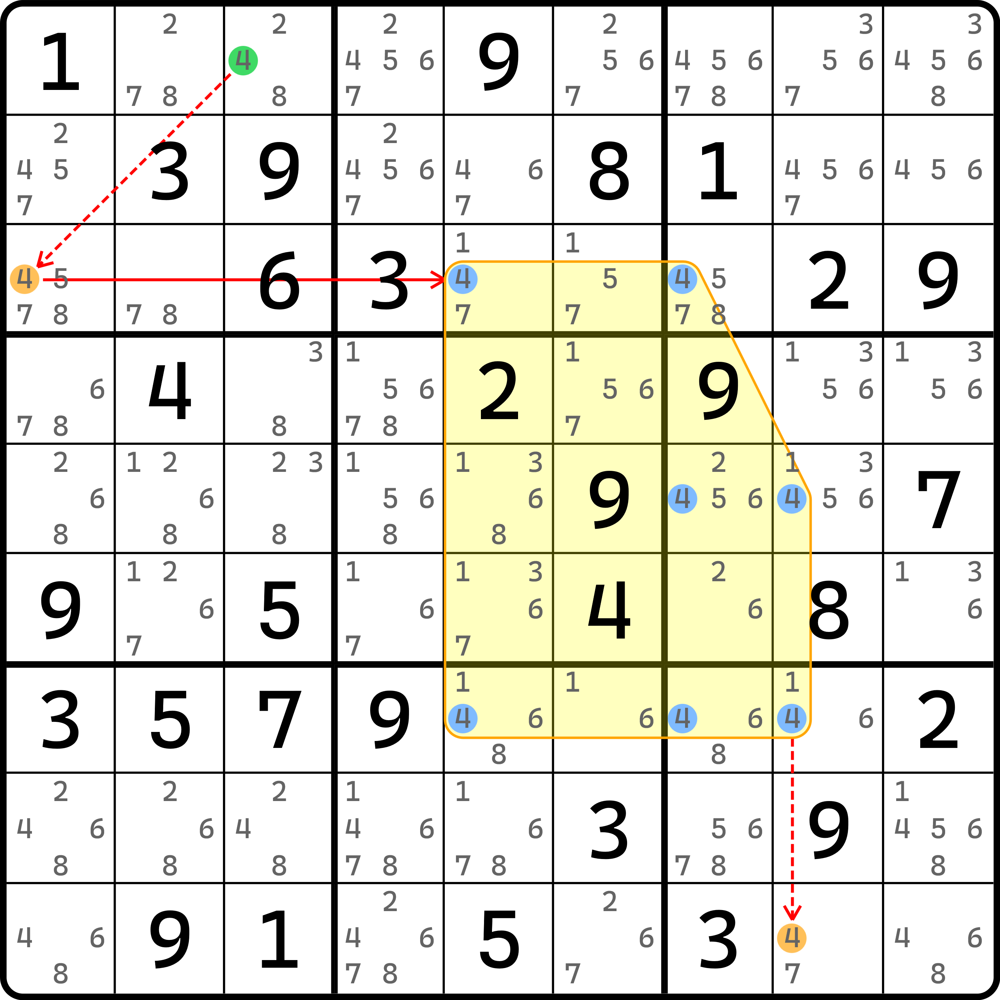<figcaption><p>证明 4 弱链关系的成立</p></figcaption></figure>

如图所示。这里我们套了一个鱼结构作为节点传入。其中蓝色的 4 就是鱼的本体了，强区域是 `4r357`，弱区域是 `4c578`。显然，`r3c1(4)` 是这个鱼的毛刺，于是构成了强链关系才能有这个图里的连接过程。

<figure>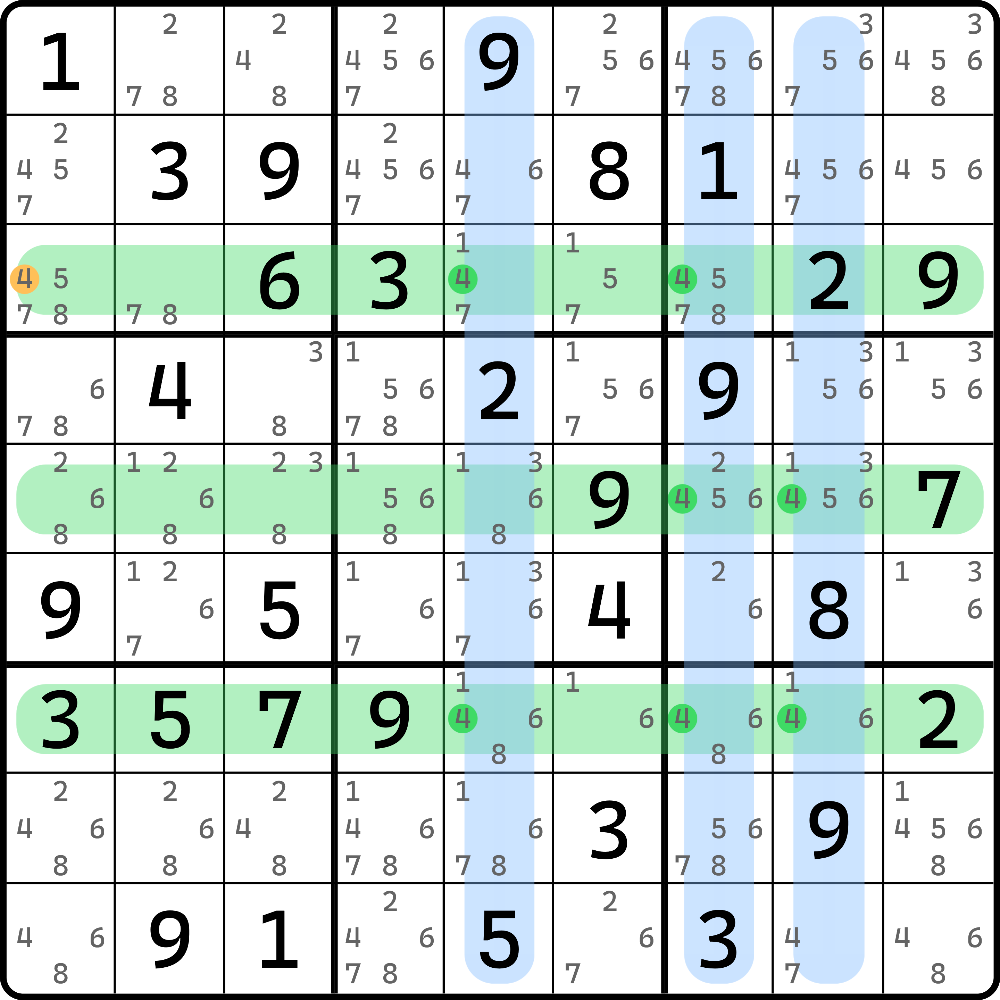<figcaption><p>4 的鱼的强区域和弱区域</p></figcaption></figure>

我们再来看 7 的弱链关系的由来。

<figure>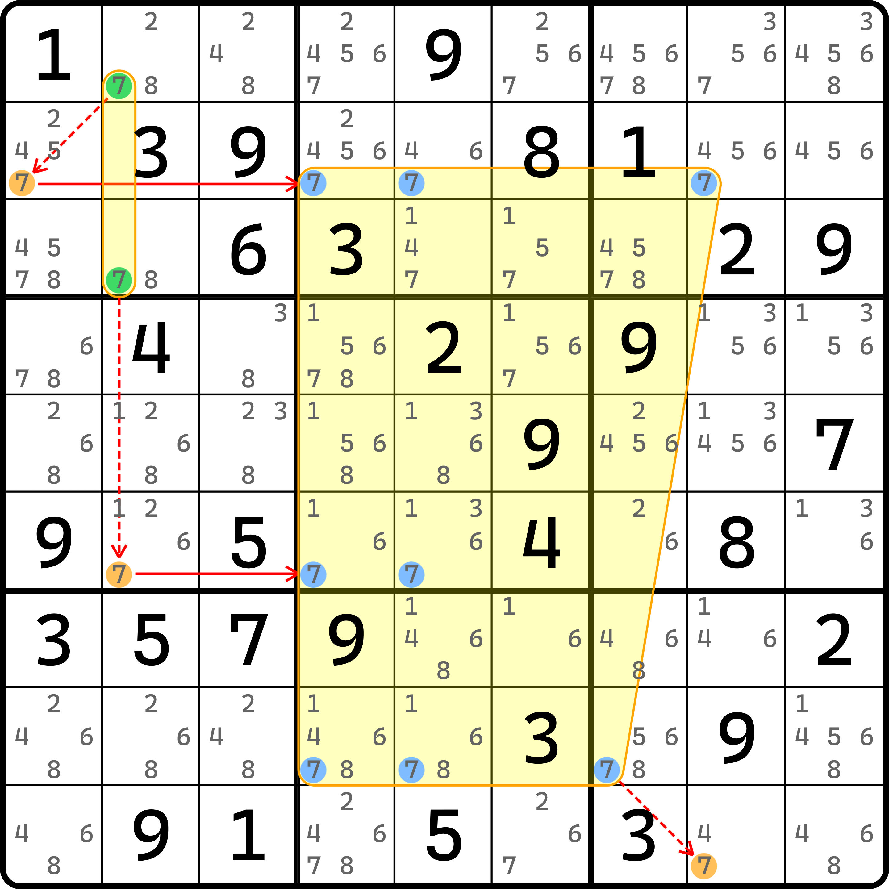<figcaption><p>证明 7 弱链关系的成立</p></figcaption></figure>

如图所示。这个稍微麻烦一些。如果我们从 `r13c2(7)` 出发的话，我们需要引出两个分支。

<figure>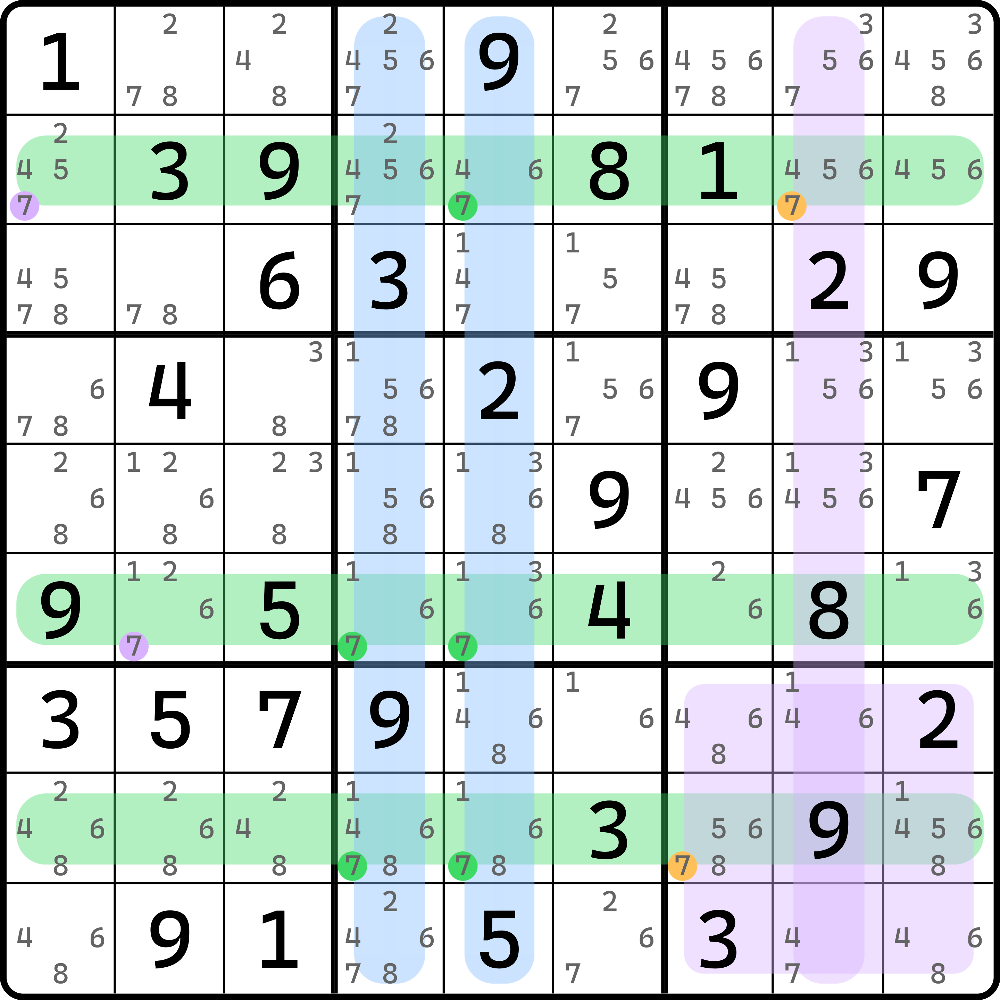<figcaption><p>7 的鱼的强区域和弱区域</p></figcaption></figure>

如图所示。这次我们要两种配色了，这次鱼鳍只能涂不同的颜色，因为这次 7 的鱼是一个鳍鱼，而不是标准的鱼，这个鱼甚至同时有毛刺和鱼鳍。

所以，这个环是由两个鱼构造出来的弱链关系，才有了环。所以是里一个外部环；另外，外部环嵌套了两个鱼结构，这里看起来就是普通的鱼和一个鳍鱼，不过你也可以理解为它是解鱼，因为头尾毕竟有弱链关系构成，所以算整体看也可以看成是解鱼。如果看成普通的鱼也是可以的，不过这个例子比较复杂，所以放在普通的鱼的例子里去会比较难接受一些。有了秩会好理解一点。

那么，删数呢？删数就不用多说了。整个环就两个弱链关系，而且还都是解鱼构成的，所以删数自然就是所有解鱼里的弱区域的删数了。不过要注意的是，7 的鱼是鳍鱼，所以 7 不能用作删数，因为你无法确保鱼鳍 `r2c8(7)` 和 `r8c7(7)` 具体是哪一个成立，所以 7 的鱼所产生的结构里弱区域的实际填数位置是不定的。所以只有 4 的鱼是可以用来删数的。当然，这里你也可以理解为 7 的鱼是鳍鱼，秩不是 0（有两个鱼鳍，所以秩等于 2）不能当零秩结构删数用；但 4 的鱼是零秩结构，所以可以拿来删数。

<figure>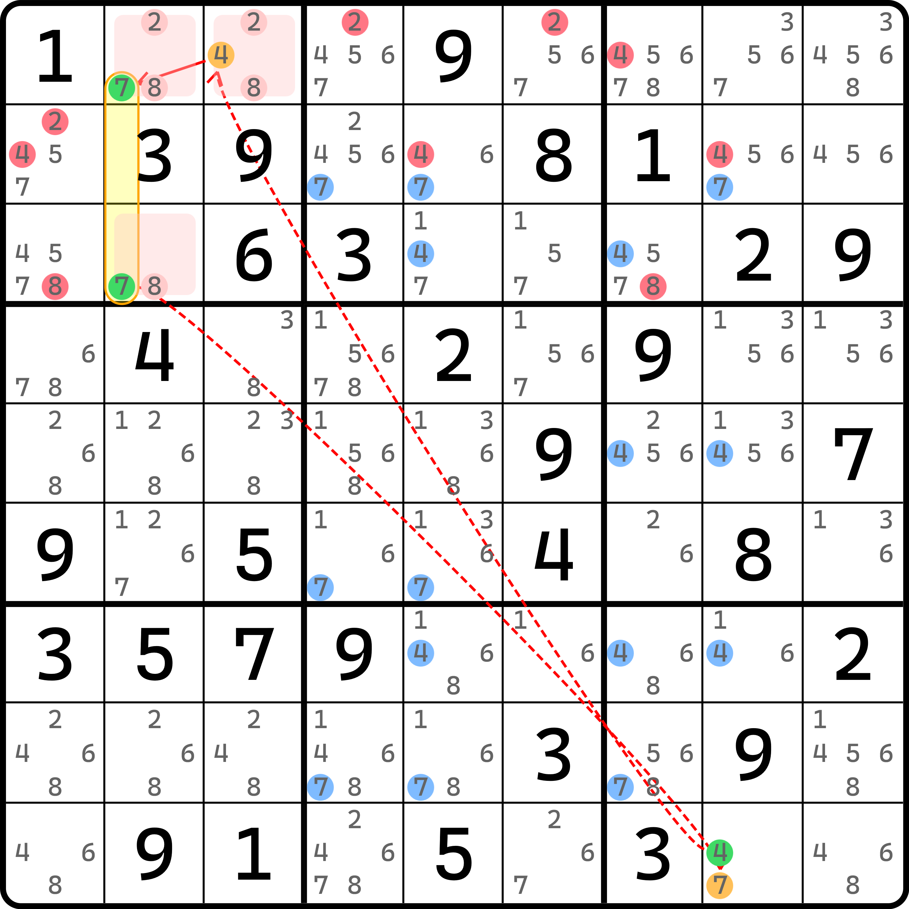<figcaption><p>外部环的删数</p></figcaption></figure>

如图所示。这是这个外部环的删数。首先，待定数组的删数包含 `r1(2)` 和 `b1(2)` 里的全部余下的 2，8 则是 `b1` 里其余的 8；刚才还说，4 是可以删数的，所以 4 都可以用于删数。

不过，这个删数是不全的。实际上，`r3c7(8)` 也可以删数。这是因为结构里我们已经知晓 `7r13c2-7r9c8` 的弱链关系成立，所以理应只看 `r3c2` 的话，`7r3c2-7r9c8` 亦成立。

不过要注意的是，因为它俩不同真，所以也就意味着我们可以继续延续这个强弱关系的传递过程。此时我们借用一下 `r7` 上的待定数组就可以得到 `r3c7(8)` 的删数。

<figure>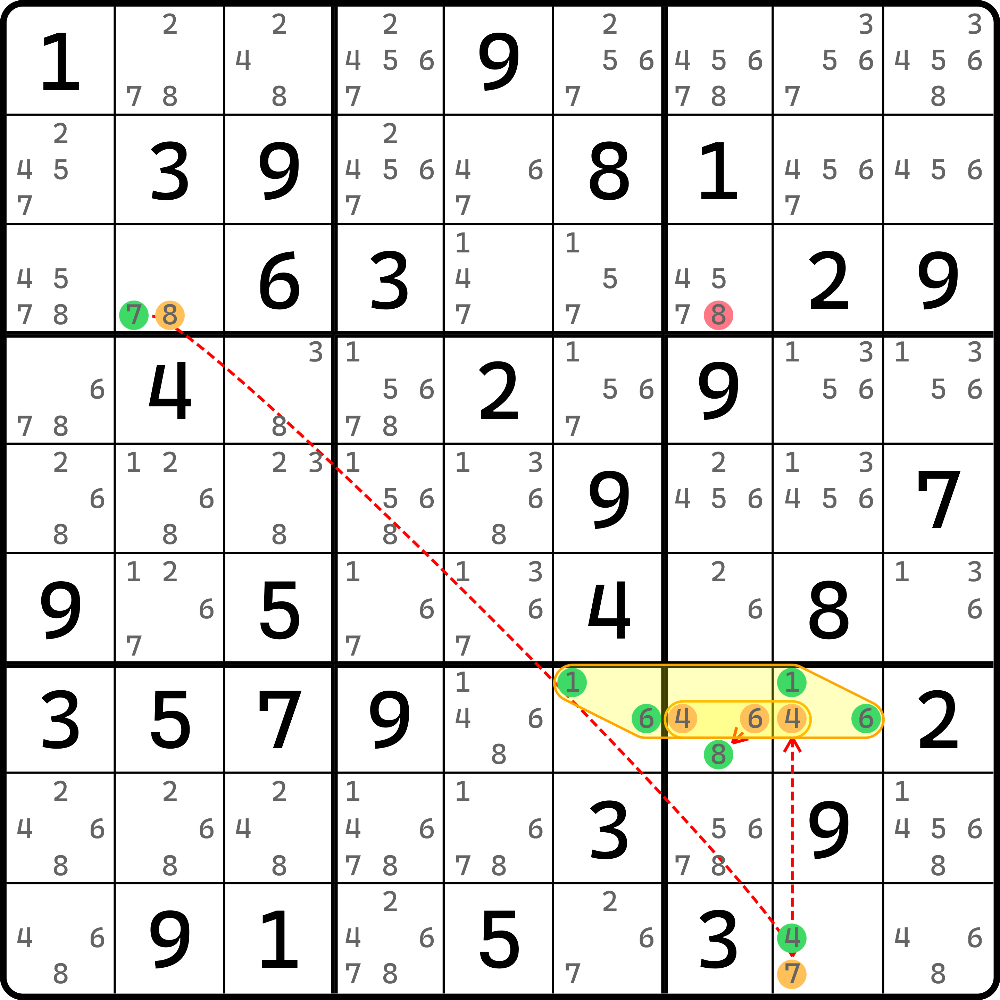<figcaption><p>延长链得到 r3c7(8) 也可以删的结论</p></figcaption></figure>

如图所示。这个链表示如下：

```
(8=7)r3c2-(7=4)r9c8:
  -4r7c7
  -4r7c8=16r7c68-6r7c7
=8r7c7
```

有这么一条动态链可以删掉 `r3c7(8)`。

当然了，一旦你删掉了 `r3c7(8)` 之后你就还可以继续延续删数。比如图中原本 `r3c1 <> 8` 可以得到，然后你现在删了 `r3c7(8)`，所以 `r3` 上可以出 8 的出数，接着因为 `r1c46(2)` 也可以删，所以你还能出 `b2` 里 2 的出数；接着你因为出了 `r2c4` 的出数，所以 `r2` 上能填 4 的只有 `r2c9`，于是你还能继续出 4 的出数。这样讨论下去就真没完了。所以让我们就到这里就结束吧。

好了，至此我们就将秩理论的内容全部结束了。
